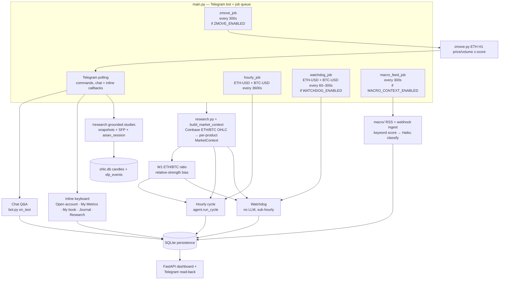
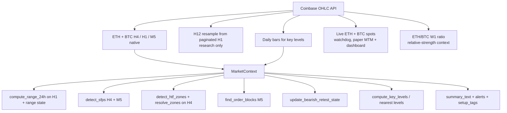
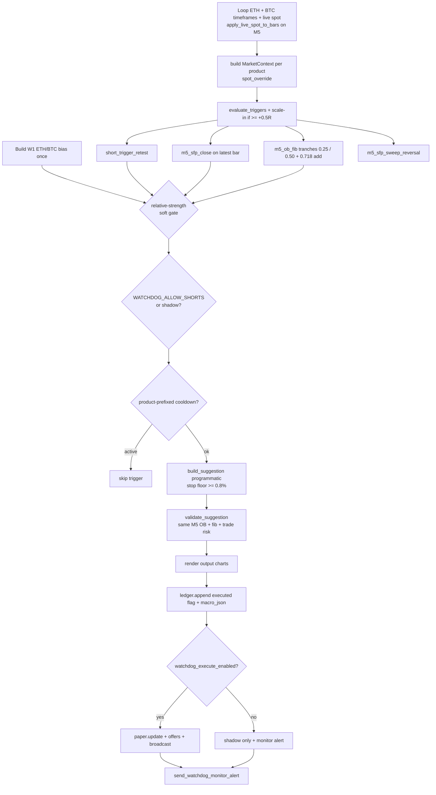
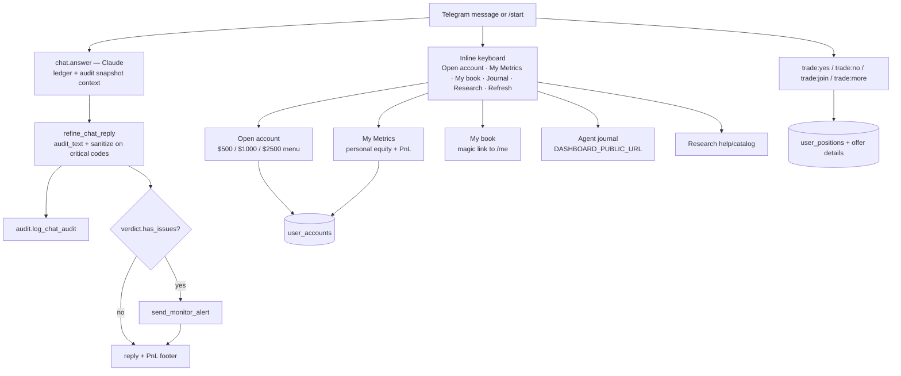
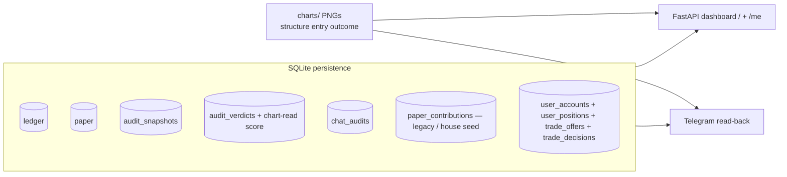

# Project state

> Single source of truth for architecture and status of the Telegram trading bot.
> See **Documentation maintenance** below — update this file (and related deploy docs) whenever behaviour changes.

**Last updated:** 2026-09-11

---

## Documentation maintenance

When you implement a change that affects architecture, runtime behaviour, config flags, deployment, or ops workflows, **update the relevant docs in the same PR/commit** — do not leave them stale.

| If you changed… | Update… |
|---|---|
| Agent flow, validation, audit, watchdog, chat, persistence, dashboard | `deploy/PROJECT_STATE.md` — diagrams, status table, config table, changelog |
| VPS setup, systemd, `.env`, subscriber onboarding, dashboard HTTPS, deploy scripts | `deploy/CLOUD.md` |
| New/changed deploy script, service unit, or one-off ops tool | The script **and** a short note in `deploy/CLOUD.md` (and changelog here if architectural) |
| `bot_config.py` tunables | Section 9 below **and** any CLOUD.md mention of that flag |

**Checklist before merging:**

- [ ] Status table and changelog reflect the change
- [ ] Mermaid diagrams still match the code path (hourly, watchdog, chat, persistence)
- [ ] Config defaults in section 9 match `bot_config.py`
- [ ] CLOUD.md updated if deploy or server ops steps changed

Related deploy docs: [`CLOUD.md`](CLOUD.md) · `setup.sh` · `update.sh` · `eth-agent.service` · `eth-dashboard.service`

---

## 1. What this system is

A Telegram bot that runs an hourly dual-asset LLM trading cycle and a sub-hourly dual-asset programmatic watchdog over Coinbase ETH-USD and BTC-USD data. W1 ETH/BTC relative strength biases asset selection and soft-gates watchdog entries. Every suggestion is validated and audited before broadcast, then applied to a **house/agent paper book** (public journal). Subscribers hold **separate personal demo accounts**; trade DMs include a decision chart plus Accept/Reject — only Accept (or a later missed-connection Join) puts that user's cash into the trade. Personal ledgers are on `/me` (Telegram magic link). State is persisted to SQLite and surfaced through a FastAPI dashboard and Telegram read-back.

Four operator-facing paths (hourly, watchdog, Telegram chat/inline UI, dashboard), one shared data/context layer, one house paper book, and per-user personal books.

---

## 2. Top-level architecture



---

## 3. Data + market context layer

`research.py` pulls ETH-USD and BTC-USD feeds from Coinbase; `patterns/market_context.py` → `build_market_context` assembles one `MarketContext` per product. `patterns/relative_strength.py` aligns weekly ETH and BTC bars into an ETH/BTC ratio, detects nearby W1 zones/SFPs, and infers `eth_strong`, `btc_strong`, or `neutral`. The hourly proposal receives that context as an asset preference; the watchdog rejects only entries that clearly fight it (long weaker asset or short stronger asset), so it remains a soft gate rather than a standalone signal.

Live strategy timeframes: **H4 → H1 → M5**. H12 remains available for research/historical studies only.



---

## 4. Hourly vision cycle (`agent.run_cycle`)

The LLM path builds both products plus W1 ETH/BTC context in one proposal call, then validates, refines, persists, and broadcasts each actionable product independently.

```mermaid
flowchart TD
    D1[ETH + BTC timeframes + daily bars] --> CTX[build MarketContext per product]
    CTX --> CH1[render marked ETH + BTC<br/>H4/H1/M5 charts]
    D1 --> RS[build + render W1 ETH/BTC ratio]
    CH1 --> PT[propose_trades_multi — Claude<br/>both assets + ratio + contexts]
    RS --> PT

    PT --> V1{_validate in analyze.py}
    V1 -->|trade| V1a[M5 OB + fib zone match]
    V1a --> V1b[validate_trade_risk — validate.py<br/>stop dist, R/R, sizing]
    V1 -->|no_trade / parse_error| S0[Suggestion]
    V1b -->|pass/fail| S0

    S0 --> REF[refine_suggestion — critic.py<br/>pre-broadcast audit loop]
    REF --> FD[verify_deterministic]
    REF --> FL[verify_llm critic<br/>if RUN_LLM_CRITIC_PRE_BROADCAST]
    FD --> OK{findings require refine?}
    FL --> OK
    OK -->|yes, passes left| RETRY[propose_trade retry<br/>with audit_feedback]
    RETRY[propose_trade single-product retry<br/>with audit_feedback] --> REF
    OK -->|exhausted passes| DOWN[downgrade / sanitize → no_trade]
    OK -->|no| CR[compose_rationale<br/>thesis then Market context]
    DOWN --> CR

    CR --> OC[build_output_charts]
    OC --> LG[ledger.append + paper.update]
    LG --> SNAP[audit.save_snapshot]
    SNAP --> MON[audit_hourly_cycle<br/>monitor verdict, run_llm=False]
    MON --> MRPT[send_hourly_monitor_report]
    LG --> BC{BROADCAST_ONLY_TRADES<br/>and no_trade?}
    BC -->|skip| SKIP[no subscriber DM]
    BC -->|send|     OFFER[user_books.create_trade_offer]
    OFFER --> SUM[display_summary deterministic blurb<br/>optional LLM if USE_LLM_DISPLAY_SUMMARY]
    SUM --> BDM[notify.broadcast<br/>decision chart + concise card<br/>Accept/Reject/See more]
    BDM --> XT[twitter_post.announce_hq<br/>same decision chart image]
```

---

## 5. Watchdog (`watchdog.run_watchdog`) — no LLM, sub-hourly



Default: **scan on, paper execute off** (`WATCHDOG_EXECUTE_ENABLED=False`). Operators flip execute via dashboard `/api/ops/watchdog-execute` (Bearer `MACRO_WEBHOOK_SECRET`) or Telegram `/watchdog on|off`. Shorts stay shadow-only while `WATCHDOG_ALLOW_SHORTS=False`.

---

## 6. Telegram chat + inline UI (`bot.py`, `telegram_ui.py`)



`Open account` creates a one-time personal demo book (not real funding). Legacy Funders are migrated to a **$1,000** personal account via `user_books.migrate_funders_to_personal_accounts` (also on `paper.init_db`). The house/agent book in `paper.py` continues to auto-take every validated trade for the public journal; user cash never mixes into house equity. Trade broadcasts send a **concise decision card** (decision chart + friendly caption with price-move % to TP1/SL, Accept/Reject/See more). The card opens with an **execution banner** in bold saying whether the order is resting unfilled (`live_pending`) or going on at market, since most HQ entries are limit orders that may never fill (`display_summary.execution_banner`). A resting order gets a **follow-up DM** on every ending — filled, refused, missed, cancelled, expired — sent only to the ids the original card reached (`live_pending.notify_ids`). Full canonical rationale and structure/entry charts are deferred to **See more**. Rejected/expired users may get one missed-connection Join invite when the house position is ≥ +0.5R.

---

## 7. Persistence + read consumers



Writers → stores:

| Store | Written by | Read by |
|---|---|---|
| `ledger` | hourly cycle, watchdog | dashboard, Telegram |
| `suggestions.reason_code` | `ledger.append` (explicit at each decision site, else `classify_reason`) | abstention-funnel queries; see `ledger.REASON_CODES` |
| `paper` | hourly cycle, watchdog | dashboard, Telegram |
| `paper_contributions` | House seed; legacy Fund rows (migration source) | Migrate script; house seed |
| `user_accounts` / `user_positions` / `user_trades` | Open account; Accept / late-join | Telegram My Metrics; `/me` |
| `trade_offers` / `trade_decisions` | Hourly + watchdog after house `paper.update`; `display_summary` sibling field; offers immutable after create | Accept/Reject/See more; participation strip; missed-connection |
| `audit_snapshots` | hourly cycle | dashboard, chat, monitor |
| `audit_verdicts` | hourly monitor, chat audit | dashboard |
| `chat_audits` | chat Q&A | — |
| `charts/` PNGs | hourly/watchdog output charts; `paper` close → `{cycle}_H4|M5_outcome.png`; HQ live close → `case_study_hq_{id}.png` | dashboard `/api/chart`, `/api/live-chart/{id}`, Telegram |

---

## 8. Component status

Legend: ✅ done · 🟡 in progress · 🔧 needs work · ⬜ planned · ⚠️ known issue

| Component | File(s) | Status | Notes |
|---|---|---|---|
| Coinbase OHLC ingest | `research.py` | ✅ | H4/H1/M5 live; H12 resample research-only; daily; live spot |
| Market context | `patterns/market_context.py`, `patterns/relative_strength.py` | ✅ | per-product alerts/tags/summary plus W1 ETH/BTC bias |
| SFP detection | `patterns/sfp.py` | ✅ | H4 + M5 (live); H12 still used in research |
| HTF zones | `patterns/htf_structure.py`, `patterns/zone_resolver.py` | 🟡 | detect_zones on H4; resolve_zones tuning |
| Order blocks | `patterns/order_block.py` | 🟡 | M5 OB + fib matching |
| 24h range | `patterns/range_24h.py` | ✅ | computed on H1 bars |
| Bearish retest state | `patterns/setup_state.py` | ✅ | `signal_state` keys are product-scoped (`<key>:<product_id>`) — see 2026-09-10 changelog |
| Hourly cycle | `agent.py` | ✅ | dual ETH/BTC contexts, charts, per-product persistence/broadcast |
| Trade proposal (LLM) | `analyze.py` | ✅ | one 0–2 trade multi-asset call; single-product critic retries; pattern PNGs off by default |
| Trade risk validation | `validate.py` | ✅ | stop dist, R/R, USD-notional sizing |
| Refine / critic loop | `critic.py` | ✅ | pre-broadcast retries; context-conflict ack; thesis + Market context compose; post-cycle monitor |
| Watchdog | `watchdog.py` | ✅ | loops ETH/BTC; one fire/product/tick; product cooldown; macro + ETH/BTC soft gates |
| Macro context | `macro/` | ✅ | RSS poll, webhook ingest, keyword→`ANTHROPIC_MODEL_FAST` classify/pulse, dashboard |
| OHLC history vault | `ohlc_cache.py`, `backfill.py` | ✅ | ETH+BTC H1/D1 cache; W1/H12 derived; `--product` CLI |
| SFP pattern index | `patterns/sfp_index.py` | ✅ | deterministic `sfp_events` in ohlc.db; rebuild on backfill/study |
| Chat Q&A | `bot.py`, `chat.py` | ✅ | snapshot-grounded + chat audit |
| Telegram research | `research_reports/`, `metrics/`, `analytics.py` | ✅ | `/research` catalog; snapshots + asian_session; d1/w1/h12 SFP + invalidations; ETH/BTC |
| Z-Move alerts | `zmove.py` | ✅ | ETH H1 \|z\|≥2 price/volume → subscriber broadcast + cooldown |
| Persistence | `ledger.py`, `audit.py`, `paper.py`, `user_books.py` | ✅ | SQLite |
| Paper trading | `paper.py` | ✅ | house multi-asset book; fixed 25% deploy; qty caps; FIFO; staged TP scale-out; outcome charts |
| Personal books | `user_books.py` | ✅ | open-account sizes; offers; Accept/Reject/expire; late-join; user SL/TP; `/me` tokens; `display_summary` on offers |
| Telegram beta UI | `bot.py`, `telegram_ui.py`, `display_summary.py` | ✅ | Open account / My Metrics / My book / Journal / Research; trade Yes/No/Join/See more; concise cards (deterministic blurb by default) |
| Decision chart | `charts.build_decision_chart` | ✅ | clean candles + red SL / green TP1 bands with % annotations; source/SL/TP-reference-aware M5 history (up to 300 bars) |
| Dashboard | `dashboard/` | ✅ | Intelligence hub: Brain (vision) · Eva Trades (HQ ICT live + paper) · Yield Generation · Trade mill (idea stream + nano-ETH live clip). Consumer `/feed` + `/me` |
| Investor view | `dashboard/investor.py`, `templates/investors.html` | ✅ | Private `/investors` link: Eva portfolio value with week/month/year chart, realized day/YTD, unrealized, Coinbase CDE Cross Margin ratio pill (maintenance ÷ funds for margin, liq at 100%, amber ≥80%, red ≥90%), every open Eva position (size + liq price), per-day P&L (`% of position` = return on traded notional; Exits = booking events), annotated case-study chart on closed cards. Token-gated via `INVESTOR_ACCESS_TOKEN`, `noindex`, unlinked from the hub |
| Eva case study | `case_study.py` | ✅ | On HQ live close, render a dark TradingView-style annotated PNG (entry / stop / TPs / discretionary post-trade note). Original entry rationale is the first LLM input. Fail-soft; mill skipped. Shown in the closed-trade dropdown on Eva Trades and `/investors` |
| Live execution | `execute.py` | ⬜ | shadow/live path not built |
| OHLC history cache | `ohlc_cache.py` | ✅ | research/backfill; ETH+BTC H1/D1; not hot path |
| Legacy scheduler | `scheduler.py` | ⚠️ | deprecated; use `main.py` |

---

## 9. Feature flags / config

Defaults from `bot_config.py` (non-secret tunables). Secrets and portfolio size live in `.env` — see `CLOUD.md`.

| Flag / setting | Default | Effect |
|---|---|---|
| `WATCHDOG_ENABLED` | `True` | enables sub-hourly watchdog **scan** job |
| `WATCHDOG_EXECUTE_ENABLED` | `False` | paper fills + subscriber offers when True; else shadow-log only (runtime override via meta / dashboard / `/watchdog`) |
| `WATCHDOG_ALLOW_SHORTS` | `False` | when False, short triggers are shadow-logged only |
| `SCALE_IN_MIN_R` | `0.5` | scale-in requires unrealized ≥ this many R |
| `CYCLE_INTERVAL_SEC` | `1800` | full LLM trade-cycle cadence, wall-clock aligned (so :00 and :30). Floored at 60s in `main.py`. Doubles idea flow and LLM spend against the old 3600; how many ideas can be *held* is bounded by `LIVE_MAX_OPEN_HQ` |
| `WATCHDOG_INTERVAL_SEC` | `60` | scan cadence (clamped 60–300s in `main.py`) |
| `WATCHDOG_COOLDOWN_SEC` | `1800` (30m) | suppress repeat fire on same M5 OB |
| `BROADCAST_ONLY_TRADES` | `True` | suppress `no_trade` subscriber DMs |
| `RUN_LLM_CRITIC_PRE_BROADCAST` | `False` | run LLM critic in refine loop (deterministic critic always runs) |
| `MAX_REFINE_PASSES` | `1` | audit retry budget before downgrade |
| `INCLUDE_PATTERN_IMAGES` | `False` | attach Trading Guide reference PNGs to vision calls |
| `USE_LLM_DISPLAY_SUMMARY` | `False` | LLM trade-card blurbs; else deterministic setup blurb |
| `CASE_STUDY_ENABLED` | `True` | generate annotated close charts for Eva (HQ) live trades |
| `USE_LLM_CASE_STUDY` | `True` | Haiku writes callout copy from the entry rationale + ledger facts; off = deterministic sentences |
| `MAX_OPEN_TRADES` | `20` | paper FIFO cap |
| `ENTRY_FIB_LOW` / `ENTRY_FIB_HIGH` | `0.25` / `0.50` | M5 OB entry band; watchdog tranches at each level |
| `ADD_FIB_LEVEL` | `0.718` | scale-in adds another `TRADE_DEPLOY_PCT` (1.25× max base exposure) |
| `ENTRY_TRANCHE_DEPLOY_PCT` | `0.125` | per-tranche deploy (half of `TRADE_DEPLOY_PCT`) |
| `TRADE_DEPLOY_PCT` | `0.25` | fixed fraction of **live paper equity** deployed as notional per full idea (R/R unaffected) |
| `FIB_LEVEL_TOLERANCE_PCT` | `0.008` | looser "near" fib mark for M5 watchdog |
| `TRADED_PRODUCTS` | `("ETH-USD", "BTC-USD")` | products the hourly cycle and watchdog may trade concurrently |
| `PRODUCT_QTY_CAPS` | `{"ETH-USD": (0.25, 2.0), "BTC-USD": (0.005, 0.05)}` | per-product paper size guardrails used by `qty_caps(product_id)` |
| `MIN_ETH_QTY` / `MAX_ETH_QTY` | `0.25` / `2.0` | legacy aliases for the ETH entries in `PRODUCT_QTY_CAPS` |
| `RELATIVE_STRENGTH_ENABLED` | `True` | adds W1 ETH/BTC proposal bias and watchdog soft gate |
| `PAPER_CONTRIBUTION_USD` | `1000.0` | legacy default / migrate amount alias |
| `PAPER_ACCOUNT_SIZES` | `(500, 1000, 2500)` | Open account menu sizes |
| `PAPER_ACCOUNT_DEFAULT_USD` | `1000.0` | migrate amount for legacy Funders |
| `APPROVAL_WINDOW_MIN` | `15` | Accept window before pending → expired |
| `MISSED_CONNECTION_R` | `0.5` | house unrealized R to trigger late-join DM |
| `USER_MIN_DEPLOY_USD` | `25.0` | minimum notional to Accept / late-join |
| `HOUSE_CONTRIBUTION_TELEGRAM_ID` | `0` | reserved Telegram ID for the house seed row in `paper_contributions` |
| `OB_MIN_WIDTH_PCT` | `1.25` | default / ETH HTF (H4) OB zone width floor (% of mid price) |
| `PRODUCT_OB_MIN_WIDTH_PCT` | `{"ETH-USD": 1.25, "BTC-USD": 0.60}` | per-product HTF OB/breaker width via `ob_min_width_pct(product_id)` |
| `OB_MIN_WIDTH_PCT_M5` | `0.15` | minimum M5 entry OB width (M5 candles are ~10× thinner than H1) |
| `PAPER_EPOCH_LABEL` | `"5k_usd"` | dashboard epoch label |
| `PAPER_PENDING_EXPIRY_HOURS` | `4.0` | **backstop only.** Re-evaluation is what retires a pending paper entry: a fresh plan supersedes it, a `no_trade` verdict cancels it, and Eva re-plans a product ~65% of the time, so the median plan dies in ~1.4h at a 30-minute cadence. This clock only binds when a product stops being evaluated at all. Do not tune against P&L — the limit-fill sweep is non-monotonic across expiries |
| `MACRO_CONTEXT_ENABLED` | `True` | RSS poll + macro advisory injection |
| `MACRO_POLL_INTERVAL_SEC` | `300` | RSS poll cadence |
| `MACRO_MIN_SEVERITY_INJECT` | `3` | min LLM severity for prompt injection |
| `MACRO_PULSE_MIN_SEVERITY` | `4` | position-aware pulse + mechanical house `tighten_sl` |
| `MACRO_WATCHDOG_GATE_MIN_SEVERITY` | `4` | soft gate conflicting watchdog entries (not raised after audit) |
| `MACRO_LLM_PROMOTE_THRESHOLD` | `40` | min keyword_score before Haiku classify |
| `MACRO_DEFAULT_TTL_HOURS` | `24` | fallback TTL for classified events |
| `ZMOVE_ENABLED` | `True` | ETH H1 price/volume z-score subscriber alerts |
| `ZMOVE_INTERVAL_SEC` | `300` | z-move scan cadence |
| `ZMOVE_THRESHOLD` | `2.0` | \|z\| fire threshold |
| `ZMOVE_LOOKBACK_H` | `168` | hourly lookback for mean/std |
| `ZMOVE_COOLDOWN_SEC` | `7200` | per-metric suppress window after fire |
| `ZMOVE_PRODUCT_ID` | `"ETH-USD"` | product scanned for z-moves |
| hourly interval | `3600s` | `hourly_job` cadence in `main.py` (wall-clock aligned to the top of the hour) |
| `validate.MIN_STOP_DISTANCE_PCT` | `0.008` (0.8%) | hard floor on stop distance (LLM + watchdog) |
| `INTELLIGENCE_ENABLED` | `True` | hourly BTC/ETH stance batch (H4/H1/M15) persisted + served on `/api/v1` |
| `HQ_IDEAS_INTERNAL_ONLY` | `False` | HQ (abstention-first ICT) cards now DM **all public subscribers** with Accept/Reject and a "High Quality" title label (2026-08-12); set `True` to gate back to `INTERNAL_TELEGRAM_IDS`. Ledger + house paper book record every idea either way |
| `DAILY_PERFORMANCE_POST_ENABLED` | `True` | once-daily mill volume-paper digest ("you'd be up X%" + winner breakdown) as an X thread and Telegram mirror |
| `DAILY_DIGEST_HOUR_UTC` | `21` | daily digest post time (UTC) |
| `DAILY_DIGEST_SOURCE` | `"mill"` | mill volume paper, not Eva HQ paper |
| `MILL_PAPER_EPOCH_START` | `"2026-09-01"` | UTC; digest and (after archive) `/volume` mill book only count paper opened on/after this date |
| `TWITTER_ENABLED` (env) | `false` | X announcement mirror for HQ cards + daily digest (OAuth 1.0a keys in `.env`; announcement-only, no Accept/Reject on X). HQ and mill tweets attach the Telegram decision chart when it rendered. The trade_ideas mill mirrors its broadcast idea cards with the same keys |
| `FUNDING_ENABLED` | `True` | perp funding regime tracker (Binance prints for BTC/ETH) |
| `FUNDING_INTERVAL_SEC` | `3600` | funding refresh cadence (prints land every 8h) |
| `FUNDING_PERSIST_PERIODS` | see `bot_config` | prints required before a regime counts as persistent |
| `FUNDING_SWITCH_CONFIRM_PERIODS` | see `bot_config` | prints required to confirm a first switch (chop is suppressed) |
| `LONG_THESIS_ENABLED` | `True` | daily BTC 4-year-cycle thesis + annotated chart |
| `LONG_THESIS_INTERVAL_SEC` | `86400` | long thesis refresh cadence |
| `LIVE_HQ_EQUITY_USD` | `2000.0` | HQ ICT live margin sleeve |
| `LIVE_HQ_RISK_PCT` | `0.007` | **HQ sizing driver.** One clip is however many whole CDE nanos fit this much risk, measured against the **fill price** not the planned entry. $14 on a $2,000 sleeve sizes ETH at roughly 2–6 nanos by stop distance. Levels never move to fit; only the clip changes. Raised from `0.005` on 2026-09-02 because one BTC nano risks $5.33–$15.43 across the recorded book, so $10 refused BTC on any stop wider than 1,000 points |
| `LIVE_TRADE_DEPLOY_PCT` | `0.50` | fallback notional for a product with no qty floor; also the `notional_per_name_usd` reference on the vault feed |
| `LIVE_MAX_OPEN_HQ` | `4` | skip new HQ live ideas when full. At `LIVE_HQ_RISK_PCT` = 0.7%, four concurrent clips risk ≤2.8% of sleeve in total, still well inside the $160 daily loss limit |
| `LIVE_MAX_PER_PRODUCT_HQ` | `2` | concurrent HQ positions in one product. At `1` the second slot was BTC-only in practice, since only two products trade |
| `LIVE_MAX_LEVERAGE` | `1.8` | total HQ notional ≤ sleeve × this (hard ceiling 2x). A **notional** ceiling, not a risk one — per-trade risk is bounded by `LIVE_HQ_RISK_PCT`. Too low a value now shows up as trimmed clips rather than skips |
| `LIVE_DAILY_LOSS_LIMIT_USD` | `160.0` | HQ live halt until next UTC day |
| `LIVE_PENDING_ENTRIES_ENABLED` | `True` | **HQ fill model.** A plan whose entry has not traded is parked in `live_pending` instead of bought at the mark, and the watchdog sends it the moment price arrives. Set `False` to go back to market-on-mint |
| `LIVE_PENDING_EXPIRY_HOURS` | `4.0` | **backstop only**, same argument as `PAPER_PENDING_EXPIRY_HOURS`. What retires a live plan is the next cycle superseding it or declining the product; this clock only binds if a product stops being evaluated. Do not tune against P&L — per-trade R falls monotonically as the window widens, so any interior optimum is noise |
| `LIVE_HQ_CLEARS_MILL` | `True` | **Temporary HQ testing priority.** Before an HQ live entry, flatten any open mill clip on the same product that is the *opposite* direction. Shared CDE brackets otherwise reject the HQ order (`PREVIEW_ORDER_SIZE_EXCEEDS_BRACKETED_POSITION` — HQ BTC short 2026-09-03). Same-direction mill is left alone; mill refill is skipped on these closes. Turn off when HQ no longer needs the lane |
| `LIVE_MILL_SLEEVE_USD` | `1400.0` | mill live clip sleeve (same Coinbase account, partitioned); funded +$1,000 on 2026-08-28 |
| `LIVE_PRODUCT_QTY_FLOORS` | ETH `0.1` / BTC `0.01` | one CDE nano — the unit both sleeves size in. Mill clips are **always one**; HQ takes as many as `LIVE_HQ_RISK_PCT` affords. Notional is qty × mark; a clip too big for the sleeve is trimmed to the headroom rather than refused |
| `LIVE_MILL_MAX_OPEN` | `3` | mill live open-position cap |
| `LIVE_MILL_MAX_FILLS_PER_DAY` | `0` | mill live daily fill cap; `0` = none (sleeve / open / daily loss still bind). Closed clips free the slot for the next mint |
| `LIVE_MILL_DAILY_LOSS_LIMIT_USD` | `112.0` | mill live halt until next UTC day (8% of sleeve, same ratio as HQ) |
| `LIVE_MILL_AUTO_FILL_ENABLED` | `True` | FIFO self-fill so the book is never empty; set `False` to make every clip operator-driven |
| `LIVE_MILL_AUTO_MIN_CONFIDENCE` | `0.5` | conviction floor for a self-fill. Admits news (0.6), funding (0.6), spike (0.625+), zmove (0.5+), cascade (0.5); excludes session-open cards (0.4). Manual Accepts bypass it |
| `LIVE_MILL_FILL_TELEGRAM_IDS` | 2 ids | Telegram ids whose **Accept** takes a real clip. Everyone else's Accept stays paper-only |
| `LIVE_FILL_ALERTS_ENABLED` | `True` | push a Telegram card on every live open **and** close (both sleeves). Off = fills are only discoverable in the log |
| `LIVE_ALERT_TELEGRAM_IDS` | = `LIVE_MILL_FILL_TELEGRAM_IDS` | extra chats for fill/close/halt alerts, on top of `TELEGRAM_ADMIN_CHAT_ID`. De-duped; one unreachable chat never silences the others |
| `LIVE_REVALIDATE_ON_FILL` | `True` | re-check an idea's levels against the live mark before any money moves. Fails **open** when no mark can be read, so a ticker outage is not a trading outage |
| `LIVE_MAX_CHASE_R` | `0.5` | how far price may run past the entry, in units of planned risk, before an Accept is refused as `chased` |
| `LIVE_MIN_FILL_RR` | `1.0` | reward:risk floor for the re-anchored plan, measured against the **average of the targets still ahead** — not TP1, which a scale-out ladder puts close in on purpose |
| `LIVE_TP_MIN_EDGE_PCT` | `0.1` | a target nearer the mark than this is dropped rather than rested |
| `IDEA_EXPIRY_MINUTES` | `15` | how long a posted card stays acceptable; past it the idea is marked `expired` and a late Accept is refused. `0` disables |
| `LIVE_MILL_REOFFER_ENABLED` | `True` | when a mill clip closes, replay the recent backlog to refill the sleeve instead of waiting for the next mint |
| `LIVE_MILL_REOFFER_MAX_AGE_MIN` | `120` | sweep lookback. Deliberately longer than `IDEA_EXPIRY_MINUTES`, and **expired cards are still swept**: expiry governs what a person may tap Accept on, while the sweep re-prices against the live mark first. At ~20-30 fillable mints/day a 15-minute lookback would find nothing in most windows |
| `INVESTOR_ACCESS_TOKEN` (env) | unset | gate for the private `/investors` link. Set → the page and `/api/investors/snapshot` require `?k=<token>` once and then ride an httponly cookie; anything else **404s** (not 401, so a guess never confirms the page exists). Unset → the page stays reachable but unlisted, the same posture as `/volume` |
| `INVESTOR_SESSION_TTL_SEC` (env) | `2592000` (30d) | lifetime of the investor cookie once the token has been presented |

---

## 10. Known issues / open questions

- [x] Live execution path (`execute.py`) implemented and **armed** — `EXECUTION_MODE=live` as of 2026-08-28
- [ ] **`EXECUTION_MODE` is global, not per-lane.** `live` arms the HQ hourly sleeve ($1,000/idea, 2 open) *and* the mill sleeve together; only the watchdog has its own gate (`WATCHDOG_LIVE_ENABLED`). Adding a `LIVE_HQ_ENABLED` gate would let the two lanes be armed independently
- [ ] **`halt_live()` writes one global `live_halt` key.** An HQ daily-loss halt ($160) also pauses mill fills, and vice versa ($112). Per-sleeve halts would need separate keys
- [x] ~~**The auto/FIFO path gets exactly one chance per idea, at mint.**~~ Closed 2026-08-31 by `trade_ideas_bridge.sweep_reoffer`, called from `_close_out` whenever a mill clip closes: the freshest qualifying ideas are replayed through `execute_mill_idea` as auto fills, so the sleeve no longer sits idle waiting for a brand-new mint. The mill still only offers once at mint (its own code is not deployable), but the hub now re-offers on its own
- [ ] **The mill's clip is always exactly one contract, so it can never scale out.** `_mill_clip` sizes to `LIVE_PRODUCT_QTY_FLOORS` (0.1 ETH / 0.01 BTC) and `_tp_ladder` then puts the whole clip on TP1. Mill clips are therefore all-or-nothing and the stop trail never engages on them; only HQ's larger clips ladder. Raising mill size to 2–3 contracts is what would make its exits behave like HQ's
- [ ] **Sleeve sizes are constants, never reconciled against the broker.** `LIVE_MILL_SLEEVE_USD` / `LIVE_HQ_EQUITY_USD` are trusted blindly by the exposure checks; nothing compares them to `get_account_summary()`. Funds sitting in the spot/USDC wallet rather than the CFM futures wallet are invisible to the bot, so clips can be sized against capital the account does not have. `deploy/diagnose_live.py` reports the real futures cash — the **sizing path still uses the constants**
- [ ] **Investor gain % assumes no deposits or withdrawals.** With a live balance the page derives its capital base by stripping YTD realized and the open mark out of today's equity. Any funding event (the mill sleeve was topped up $1,000 on 2026-08-28) silently shifts that base, which is why every percentage is labelled an estimate. A dated `live_nav_snapshots` table, or a manual deposits ledger, is what would make it exact
- [ ] **`/opt/trade-ideas` on the VPS is not a git repo**, so the mill's own changes cannot be deployed with `git pull` and are shipped hub-side only. Behaviour stays correct because every real limit is enforced in `execute.execute_mill_idea`. This bit once: `ideas.live_fill_type` / `live_filled_by` were added to the mill's `store.py` on 2026-08-28 but never reached the server, so every hub write to them failed silently until `trade_ideas_bridge._ensure_hub_columns` started adding them on connect (2026-08-31). Any *new* column the hub needs on `ideas` must go in `_HUB_COLUMNS`, not just in the mill's schema
- [ ] **`m5_sfp_sweep_reversal` is measurably harmful and should be fixed or removed.** −0.443R over 28 resolved shadow fires, 95% CI [−0.780, −0.065], below its placebo's 0th percentile, −$167 unconstrained. It is the only watchdog trigger whose swing-derived stop is computed and then thrown away (`watchdog.py:647`) in favour of the swept level plus a 0.25% buffer, giving it the tightest stop of any trigger at 0.80%. n=28, so treat the size as directional, but it is the only trigger the study supports changing. See `trade_ideas/analysis/WATCHDOG_FINDINGS.md`
- [x] ~~**A resting HQ plan never tells subscribers what became of it.**~~ Closed 2026-09-11: `live_pending` stores the card's actual audience in `notify_ids` and DMs them on all five endings (`filled`, `refused`, `missed`, `cancelled`, `expired`). Supersession is deliberately silent because the replacing plan broadcasts its own card in the same cycle
- [ ] **Nothing ever prunes `charts/`.** 21,976 PNGs on the VPS as of 2026-09-10, growing ~500/day at 10–16 per 30-minute cycle, and `chart_view.py`, `notify.py` and `status.py` all `glob()` that directory. A restart does not help. Disk exhaustion is the eventual failure; slower globs come first
- [ ] **All jobs share one 5-thread pool with the trade cycle.** Every `main.py` job and eleven `bot.py` handler paths use `run_in_executor(None, ...)`, i.e. the event loop's default `ThreadPoolExecutor`, sized `min(32, cpu_count + 4)` — 5 on this box. Any blocking call without a timeout permanently costs one of those threads, and APScheduler's `max_instances=1` then skips subsequent hourly fires while Telegram keeps answering, so the process looks healthy. The known instance of this (`macro.ingest`) was bounded on 2026-09-10; the structural risk stands for any future job. A dedicated executor for `hourly_job` would isolate the trade cycle properly. Monitor with `ls /proc/$(systemctl show -p MainPID --value eth-agent)/task | wc -l` — it should stay near 5 regardless of uptime
- [ ] **Exit reconciliation is poll-based, at watchdog cadence.** A bracket leg that fills is only booked on the next `sync_live_positions` pass, so the ledger and dashboard lag the exchange by up to one loop. Acceptable while brackets are position-sized (they cannot flip the account), but a websocket user-channel feed would make fills immediate
- [x] ~~**A retrail can strip a rung's take-profit and leave it on a bare stop.**~~ Closed 2026-09-03. The cancel-then-replace race is removed by waiting for each cancel to report terminal (`_await_cancel`) and retrying a size rejection (`_place_bracket_settling`), and the reconcile now detects a bare stop with unarmed rungs and re-arms it (`_unarmed_rungs` / `_rearm_targets`) instead of gating on a stop price the fallback already set correctly. **Still true and unfixed:** a bracket cannot be amended, so every TP1 fill forces a cancel-and-replace on the surviving rungs, and each rung is briefly uncovered while it is swapped. That window is safe only because the untouched rungs still rest with the *old, wider* stop and the trail only ever tightens — if a trail ever needs to widen a stop, this reasoning breaks and the swap order must be revisited
- [ ] **HQ and mill share one CDE contract, so opposite sleeves collide.** Mitigated for testing by `LIVE_HQ_CLEARS_MILL` (2026-09-03): HQ entry flattens an opposing mill clip first. That is sleeve priority, not a venue fix — same-direction stacking, margin, and any future mill-first policy still need separate CFM capacity or an explicit one-direction-per-instrument rule
- [ ] **A partial shortfall between the exchange and the ledger is not auto-resolved.** Because HQ and mill net into one contract, `_reconcile_flat_instrument` can attribute a *full* flatten but not a partial one; it logs `unattributed shortfall, needs review` and leaves both rows open. Watch for that line
- [x] ~~**HQ's second slot is BTC-only in practice.**~~ Closed 2026-09-02 by `LIVE_MAX_PER_PRODUCT_HQ = 2`. Eva may now hold two ETH positions, so a second ETH setup no longer waits on a BTC idea that may never come. `grep 'Vault skip: product_open'` is still the signal that the cap is binding
- [x] ~~**`LIVE_MAX_OPEN_HQ` is not the binding cap — `LIVE_MAX_LEVERAGE` is.**~~ Closed 2026-09-02 by moving both together (4 open, 1.8x). Worst case for four concurrent clips is ~$3,520 (two tight-stop ETH at 4 nanos, ~$960 each, plus two BTC at ~$800), needing 1.76x. Watch the investor margin pill: 1.8x notional against a $2,000 sleeve is a real margin draw even though per-trade *risk* fell — the two are not the same number
- [ ] **Four concurrent HQ positions have never been observed.** The caps allow it; nothing has exercised it. The first time all four slots fill, check that the margin pill, the daily loss limit ($160 = 8% of sleeve, which four losing clips at $10 each cannot reach), and `sync_live_positions` reconciliation all behave. Concurrency also raises the odds of the known `_reconcile_flat_instrument` partial-shortfall gap, since HQ and mill net into one contract per instrument
- [ ] **BTC does not fit this sleeve — three independent reasons.** (1) A single nano is one ladder rung, so a BTC clip closes fully at TP1 and later targets are never armed (`execute._tp_ladder`); `_armable_tps` keeps the record honest and `validate.compute_risk_reward` already prices R:R off TP1, so nothing is mispriced, but BTC takes full stop risk for TP1-only reward. (2) One clip is ~39% of sleeve notional. (3) Under risk-based sizing one nano risks $5.33–$15.43 depending on stop distance, so it is refused as `risk_cap` whenever that exceeds the budget. This bound the first live BTC idea after the 2026-09-02 deploy (`20260902T181231Z`, $13.60 against a $10 budget) and prompted the raise to 0.7%, which admits every recorded case bar the 1,543-point outlier — **a symptom fix, not a cause fix**: the cause is that BTC's risk granularity is coarser than a $2,000 sleeve can express. Replaying the first 15 HQ positions, BTC was 5 of 15 trades and −$33.45 of the −$36.81 total, on 1 win in 5. The sample is far too small to act on; the geometry is not
- [ ] **Next quant task: derive the stop from structure, not a multiplier.** The stop study (`analysis/run_stop_study.py`, n=14) finds Eva's stops sit inside the range its own winners routinely travel — 4 of 11 eventual winners dipped past −1.00R first, and 3 of 7 stop-outs missed by <0.10R and later paid. Widening 1.25–1.5x lifts the corrected +0.346R to +0.485/+0.501R while the same intervention on random entries *degrades*, so the effect is not the mechanical win-rate gain. **But nothing here is significant** (best p = 0.146; ~38 more clean trades needed), and 1.5x is a 6-point curve fit whose peak is inside one standard error of every other point. Ship a stop derived from the order block / swing that invalidates the thesis plus a volatility buffer — never a hardcoded multiplier. Measure against **+0.346R**, not +0.882R. Entry tuning is explicitly *not* supported by this sample; do not spend effort there
- [x] **Paper opens at the planned entry only once price trades there** — fixed 2026-09-02 (pending entries). Historical rows keep the old fills; the record before this date is still computed on entries live could not obtain, so the stop study's **+0.346R** baseline remains optimistic for live by an unmeasured amount
- [ ] **The two books now run different strategies, and that is intended.** Two independent divergences, both from 2026-09-02. **Sizing:** paper has no risk budget and no sleeve, so it takes ideas live refuses as `risk_cap` or trims for headroom (`20260902T181231Z_BTC` is the first instance). **Fill detection:** both books now wait for the entry, but they decide it differently and must not be reconciled. Paper walks M5 bar extremes since its last check, so it fills retroactively at a wick from twenty minutes ago; live tests the current mark on the watchdog's 60s pass, because a market order cannot reach back to a price that has gone. Live will therefore fill strictly less often, and the gap is the wicks paper can pretend to catch. **That divergence is correct** — do not "fix" it by giving live the M5 path, which would reintroduce the stale-level fill this whole change removes. Do not present either book as a forecast of the other. Revisit once live has ~30 pending-era positions
- [x] **Live waits for its entry as of 2026-09-02; resting a *real* limit order is still rejected.** Live parks an unreached plan in `live_pending` and sends a market order the moment price arrives, which buys the selection benefit with no venue work and no window where a filled position lacks a stop. Resting an order at the exchange stays refused: the gateway has no plain limit method (market IOC, stop-limit, bracket only), so it would need `limit_limit_gtc`/`gtd` venue code. The measured objection is stronger than the plumbing one: fills are bimodal — every trade with chase above ~0.2R never returned to the entry within the hour (0 of 8), and every trade with chase under 0.06R filled instantly at the mark, where a market order is already equivalent. So the limit never wins a better price on the trades that matter; it only declines them, making it the same 55–60% trade-count filter as the in-block gate and the chase cap. Most of its apparent edge at 1h (+$21.20 of +$39.84) was skipping 8 losers that also contained 2 of the big winners. **Re-measured 2026-09-02 under shipped config** (`analysis/run_fill_study.py`, engine calibrated to HANDOFF.md's +0.346R): every finding above holds — the paired fill-quality gain is +0.03R, i.e. nothing — but the conclusion flips, because declining is the point rather than the cost. The plans a 30-minute wait drops were worth +0.317R at Eva's entry and −0.352R at the mark live paid, and price never returned, so passing was the only way to avoid the bad version. It was shipped on that structure, not on the P&L: p = 0.269 on 15 trades, needing ~50 per arm
- [ ] **A pending entry filled from the M5 path can under-count a target.** `_fill_pending_entries` sets `path_checked_at` to the fill time, so if price touched the entry and then ran through TP1 inside the same window, the target is not seen until the next cycle. Errs toward under-reporting, which is the right direction for a book that spent its first months over-reporting, but it is a known asymmetry rather than a correct model of intrabar order
- [ ] **`S4` (paper→live divergence) cannot detect fill quality as constructed.** Both mirrors tracked paper within 0.07R, but when each book normalizes by its own entry a stop-out is −1.00R in both regardless of where it filled: on `20260902T060000Z_ETH` paper entered 2404.16 and live filled 2423, identical in R and 1.8x apart in dollars. Any future paper→live comparison needs to be in dollars at a common risk budget, or it will keep reporting agreement that isn't there
- [x] ~~**BTC is effectively not evaluated by the hourly cycle.**~~ Misdiagnosed and closed 2026-09-10. The model *was* answering for BTC; `agent.py` discarded the answer. See the changelog entry for the `select_decisions` fix. What remains true and is **not** fixed: `analyze.propose_trades_multi` asks for "0-2 actionable trades, at most one per product", which never requires a row per product, and its JSON example shows ETH populated beside a bare BTC `no_trade` — a few-shot anchor toward "ETH trades, BTC abstains". Now that BTC's real verdicts reach the ledger, whether the prompt also biases the model is finally measurable: compare `reason_code='model_no_trade'` against `'not_evaluated'` per product over a week before touching the prompt
- [ ] **`propose_trades_multi` is all-or-nothing on a malformed `product_id`.** `analyze.py:615-619` raises `unsupported product_id` / `duplicate product_id` *outside* the per-trade `try`, so one bad label (`"BTC"`, `"btc-usd"`) discards the good ETH decision too and the cycle records `"No valid dual-asset suggestion returned."`. Per-trade validation failures are already handled this way correctly (`parse_error:`); these two raises should join them. Related: there is no `stop_reason == "max_tokens"` check on the response, and `MAX_MULTI_SUGGESTION_TOKENS = 2560` is tight for two full rationales plus two macro notes, so a truncated reply is invisible except as a JSON warning
- [x] ~~**The abstention funnel is not observable without parsing prose.**~~ Closed 2026-09-10 by `suggestions.reason_code`. The baseline it was built to measure, for the 2026-09-06 → 09-10 quiet spell: 442 rows, 221 BTC fillers, 50 ETH proposals killed by `validate.py` (35 R/R below 1.0, 10 stops tighter than 0.8%, 5 order-block mismatches), 1 actionable idea — which did fill, as HQ #30. Note the R/R failures cluster at 0.24–0.60 rather than just under the line, so the 1.0 floor is **not** obviously the binding constraint; the fib entry band is the more likely candidate, since price sat inside an M5 OB but outside the 0.25–0.50 band 192 times against 55 inside over the same 5 days. **Do not tune either floor, or the band, without measuring it against the recorded book first**
- [ ] HTF zone / M5 OB resolver edge cases under active tuning
- [ ] Ops: flatten oversized open watchdog BTC shorts if still live after deploy (audit risk control)

---

## 11. Changelog

| Date | Change |
|---|---|
| 2026-09-11 | **A resting order now reports back, and a card's percentages no longer claim to be price moves.** Two follow-ups to the execution banner shipped earlier the same day. **(1)** The banner promises "it executes only if BTC rises to $78,783.23", and every way that promise could end was silent: `live_pending.sweep` fired and expired plans without a word, and `cancel` dropped them the same way, so the card sat on the subscriber's screen looking live indefinitely. `live_pending` now carries `notify_ids` (JSON, added by `_ensure_columns`, no backfill) holding the ids the card *actually* reached, and DMs them on `filled`, `refused` (price arrived but a halt or full sleeve stopped the order), `missed` (price ran through entry *and* stop before the sweep saw it), `cancelled` (Eva declined on re-read) and `expired`. The audience is **stored, not re-derived** — the subscriber list moves, and someone who joined after the card went out must not get a fill notice for an order they never saw — which is why `broadcast_to_subscribers` now returns the ids it reached and `agent` writes them via `set_recipients` after the broadcast rather than at `record` time, when `internal_only` and per-user send failures are not yet known. **A shadow order is never announced as a fill** (`_execute` returns `{"mode": "shadow"}` and sends nothing), and notice failures are caught inside `live_pending._notify` so a Telegram outage cannot take down the sweep, which reconciles live positions immediately afterwards. Supersession stays silent on purpose: the replacing plan broadcasts its own card in the same cycle, and Eva re-issues ~65% of the time, so a notice per supersession would be pure volume. **(2)** `price_move_pcts` returns *position returns*, but the card rendered them as `(+2.07% price move)` — on a short, TP1 sits below entry, so the `+` was labelling a number price has to **fall** into. Now `Target 1 is $77,840.58 (+1.20% if price falls to it), with a stop at $79,452.00 (-0.85% if price rises to it)`, via a new `display_summary.price_direction`. This touches **every card on every lane** (HQ, watchdog, mill) since it is the shared levels line; the numbers are unchanged, only the label. **Also fixed a latent double-position bug found while tracing this:** nothing retired a resting plan when a later cycle took the *same product* at market — `agent` only called `live_pending.cancel` on `no_trade` — so the stale limit survived and the sweep could fire it too, opening a second HQ clip on one product from the same idea lineage (reachable, since `LIVE_MAX_PER_PRODUCT_HQ` is 2). The market branch now cancels it silently. **Display and bookkeeping only for (1) and (2); the double-position fix prevents an unintended second entry and takes nothing Eva would otherwise have taken.** Covered by `tests/test_pending_notices.py` (17 cases incl. audience round-trip, that a fresh plan does not inherit the old audience, shadow-is-not-a-fill, and that a notice failure cannot break the sweep). |
| 2026-09-11 | **HQ cards now say whether the order is resting or going on at market.** Since `live_pending` shipped on 2026-09-02, most HQ broadcasts are limit orders that have not filled and may never fill — Eva's entry is a pullback into an M5 block, so the market is usually not there yet. The card's lead was `Potential entry near $X.` for both routes, which reads like a position the house already holds; the two BTC sells on 2026-09-11 (`20260911T160000Z_BTC` spot_sell, `20260911T163000Z_BTC` deriv_sell) were both parked at 78,783.23 with spot at 77,911 and 77,638, and nothing in either broadcast said so. `display_summary.execution_banner` now opens the card with the verdict: *resting* names the trigger price, the current mark, the gap in %, the direction price must travel (`rises` for a short, `falls` for a long) and the order type including the exposure it opens (`futures limit sell that opens a short`, not a bare "sell"), and states it may never fill; *market* says it is going on immediately and is not a resting order. **The banner cannot lie about the route** — it is driven by the same `waits` verdict `agent.run_cycle` routes the live path on, and is `None` (keeping the old lead verbatim) for callers that do not know, namely watchdog cards and `deploy/resend_suggestion.py`. Watchdog cards are deliberately left unchanged: `WATCHDOG_EXECUTE_ENABLED` is `False`, so claiming either route would be a statement about the house book nobody made. This also introduces the **first `parse_mode` use in the project** — `notify.build_caption_html` bolds only the banner headline and passes everything else through `html.escape`, so model-written prose can never open a tag, and the result must be sent *unsliced* (Telegram measures the 1024-char caption limit after parsing entities, so tags are free, but slicing could cut one in half and 400 the whole send). Worst-case visible card measures ~760 chars, so the trailing `Accept within N min · offer …` line cannot be truncated away. **Display only — no entry, sizing, stop, exit, or filter logic is touched, and no P&L claim attaches.** Covered by `tests/test_execution_banner.py` (14 cases: wording per side and per venue, the unknown-route fallback, scale-in, escaping of hostile blurb text, the caption-length bound, and that both the photo and text send paths declare HTML without slicing). **Known gap, not addressed here:** `live_pending.sweep` fills silently, so a subscriber told "it executes only if BTC rises to X" is never told when it does, nor when the plan is superseded, cancelled by a `no_trade`, or expired on `LIVE_PENDING_EXPIRY_HOURS`. The banner makes that silence more conspicuous than it was. |
| 2026-09-10 | **Measured the watchdog's 1,416 shadow fires: arming it is not supported, and one trigger is measurably harmful.** Asked because the watchdog scans every 60s for free while the LLM cycle costs ~$0.10/call, so "just arm the free scanner" looked like the cheap way to more trades. It is not. Every fire from 2026-08-06 to 09-10 was replayed on M5 candles through the *same* `placebo.ladder_walk` engine as the fill and stop studies, filled the way an armed watchdog actually fills (market at the mark — `execute._execute` sends a market order and never records a live pending; `entry` is only a sizing ref), measured in R because `vault.propose` normalises to a $14 risk budget. **The book is −0.077R per trigger and no family clears the pre-registered bar** (best Holm-adjusted p = 0.451 on 5 families, day-clustered). `m5_ob_fib_long` looked like +0.223R over 200 resolved but 34% of its fires never resolve inside 7 days (stops average 6.85% of price) and forcing those to the worst case flips it to −0.187R, with 78% of its total R from 2 of 16 days. **`m5_sfp_sweep_reversal` is the one solid result and it is negative**: −0.443R, 95% CI [−0.780, −0.065], below the placebo's 0th percentile — it is also the only trigger whose swing stop is computed then discarded (`watchdog.py:647`) for a 0.25%-buffered swept level, the tightest stop in the set. `short_trigger_retest` went 0 for 4. Under the real sleeve (4 open / 2 per product) only 112 of 1,416 fires are takeable and every candidate policy lands between −$45 and +$53 over five weeks; the min-k sweep is monotonic unconstrained but **non-monotonic once capacity-limited**, so it must not ship as a tuned value. Caveats stated in full: the window rose 19–29% (BTC/ETH) against a 77%-short book, so the same-geometry random-entry placebo also lost (−0.204R) and this is **not a fair test of the short module** — shorts beat that placebo by +0.069R, they are just still negative in absolute terms. No code behaviour changed; `bot_config.py` now carries the numbers next to `WATCHDOG_EXECUTE_ENABLED` and `WATCHDOG_ALLOW_SHORTS` so the flags are not flipped on the cheap-scanner argument. Full writeup and reproduction in `trade_ideas/analysis/WATCHDOG_FINDINGS.md` + `run_watchdog_study.py`. |
| 2026-09-10 | **The macro RSS poll can no longer park a trade-cycle thread forever.** `macro.ingest.poll_feeds` called `feedparser.parse(feed_url)`, which fetches through `urllib` without passing a timeout and so inherits the default socket timeout — `None`. A feed host that accepts the TCP connection and then never answers blocked the calling thread permanently, and no `except` helps because the call never returns. That matters because every job in `main.py` runs on the event loop's single shared `ThreadPoolExecutor` (`run_in_executor(None, ...)`), sized `min(32, cpu_count + 4)` — **5 threads on this VPS** — including `hourly_job`, which runs `run_cycle`. The poll fires every `MACRO_POLL_INTERVAL_SEC` (300s, 288×/day) across `MACRO_FEED_URLS`, so a handful of stalled feeds would starve the trade cycle; APScheduler's `max_instances=1` default would then skip every later hourly fire while Telegram (on the event loop, not the pool) kept answering, and systemd saw a healthy process. Now `macro.ingest._fetch_feed` does the fetch via `requests.get(..., timeout=15)` and hands the *bytes* to `feedparser.parse`, so the URL path is never used. **This was latent, not the cause of any observed outage**: the journal shows 0 `maximum number of running instances` warnings in 30 days and 392 `Hourly job starting` lines in the 8 days to 2026-09-10 (384 scheduled at the 1800s cadence + 8 restart bootstraps), and `suggestions` holds 48/48 distinct cycles per day for 2026-09-04..09 with a 30.6-minute worst-case gap. Fixed because it is the one mechanism found that could make Eva silently stop trading until restarted. Covered by `tests/test_macro_ingest.py`, which asserts a timeout is passed and that `feedparser.parse` receives bytes rather than a URL. |
| 2026-09-10 | **Investigated whether Eva needs a restart to trade; she does not, but restarts do inject an extra cycle.** Logged here because the question will recur. `main.py` fires a `bootstrap_cycle` `FIRST_RUN_DELAY_SEC` (10s) after start, skipped only when an aligned cycle is within 20s, so ~99% of deploys run an extra off-schedule `run_cycle`. Since 2026-08-27, 3 of 12 actionable hourly cycles landed on one (`20260902T181231Z`, `20260903T170955Z`, `20260910T203953Z` — each exactly 10s after a restart), giving 3/60 (5.0%) on bootstrap cycles vs 9/554 (1.6%) on scheduled ones. **That difference is not significant** (Fisher exact, one-sided p = 0.10, n = 3) and must not be treated as a finding. Time-of-day was ruled out as the confounder: the 14–21 UTC deploy window is *less* productive on scheduled cycles (0.5%) than other hours (2.2%). Against the "needs shaking" reading: the 7 days with **zero** restarts (2026-09-03 17:39 → 2026-09-10 20:26) produced 6 actionable ideas across 342 cycles (1.8%), three of them 59–60h into continuous uptime; and through the 09-06..09-10 drought Eva proposed 8–15 real trades a day that `validate.py` rejected, so she was never dormant. Also confirmed no in-memory market-data caches exist (every cycle refetches from Coinbase), no module-scope clock captures, and no long-lived SQLite connections; the latched `setup_state` phases live in SQLite, so a restart would not clear them anyway. Note the 2026-09-10 20:39 fill is confounded — that restart also shipped the product-scoped `signal_state` fix below, so it cannot be attributed to the restart. |
| 2026-09-10 | **Every product's real verdict now reaches the ledger, and `suggestions.reason_code` says why.** Two changes from the same health check. **(1)** `agent.run_cycle` filtered the model's suggestions to `action != "no_trade"` and kept only `suggestions[0]` when none were actionable, then backfilled any product missing from that filtered set with `"No independent setup for this asset this cycle."`. So whenever ETH was actionable, or whenever both abstained, BTC's *considered* abstention was thrown away and replaced with filler — in the 7 days to 2026-09-10, 380 of 383 BTC rows were that filler. This was read at first as the model ignoring BTC; it was not, the model answered and `agent.py` discarded it. Selection moved to a pure, unit-tested `agent.select_decisions`, which keeps every returned verdict and backfills only genuinely unanswered products. **Downstream behaviour is unchanged**: the backfill already appended a `no_trade` row per missing product, so the same rows reached `paper.update`, `vault.take`, and `execute` before and after — only the recorded rationale differs. **(2)** New `suggestions.reason_code` column (`ledger.REASON_CODES`, added by `_ensure_columns`, no backfill) makes the abstention funnel a `GROUP BY` instead of a `LIKE` over prose: `trade`, `model_no_trade`, `validation_rejected`, `proposal_error`, `proposal_empty`, `not_evaluated`, `audit_downgrade`, `watchdog_shadow`. `executed = 0` conflates all of the abstaining cases, which is why diagnosing the 2026-09-06 quiet spell needed `LIKE '%parse_error%'`. Set explicitly at each decision site (`analyze`, `agent`, `critic`, `watchdog`); `ledger.classify_reason` derives it from the prose prefixes for any caller that does not. Mirrors the role `skip_reason` plays in `vault_allocations`. **Neither change alters which trades Eva takes, at what price, or with what levels** — (1) is provably behaviour-preserving downstream and (2) is a new column nothing reads. No P&L claim. |
| 2026-09-10 | **ETH and BTC no longer share one `signal_state` row, so each product reads its own 24h range.** `RANGE_STATE_KEY` (`range_24h_announced`) and `SETUP_STATE_KEY` (`trade_setup_state`) were unscoped keys in a table both products write every cycle. `agent.run_cycle` loops `TRADED_PRODUCTS` through the same `build_market_context`, so whichever product ran last overwrote the row and the other compared its spot against the wrong asset's range. The result was a **false range break on essentially every cycle**: ETH at ~2,460 sits below BTC's 76,630–78,554 range, BTC at ~77,000 sits above ETH's 2,404–2,483, so ETH tagged `range_24h_break_below` and BTC `range_24h_break_above` **383 of 383 cycles each over the 7 days to 2026-09-10**, and 1,790 of 1,802 cycles since 2026-08-15. The prompt's Market-context block quoted the other asset's price levels verbatim, and `trade_setup_state` leaked the bearish-retest phase and supply zone the same way. Keys are now `<key>:<product_id>` via `signal_state.product_key`; a `None` product keeps the bare key, so the research/`__main__` paths that never pass one stay isolated rather than colliding with a live product. **No migration** — the stale unscoped rows are simply never read again, and each product re-emits `24h range established` on its first cycle after deploy. **This is a correctness fix with no P&L claim attached.** It changes what Eva sees on every chart read, so it plausibly changes which trades she takes, but that effect is **unmeasured** and must not be reported as an improvement; the `range_break` field feeds context only and no entry, sizing, stop, or exit rule reads it directly. Found while triaging why HQ had not filled since 2026-09-06 — it is *not* the cause of that quiet spell (see the abstention funnel: BTC was never independently evaluated, and 50 of 221 ETH proposals died on the R/R 1.0 and 0.8% stop floors). Regression tests assert both keys stay per-product and were confirmed to fail against the pre-fix behaviour. |
| 2026-09-04 | **Kalshi tab now reports the live sleeve, not the $66 soak + idle control book.** `kalshi_bridge` hides zero-trade bots, scopes win/loss/closed to `KALSHI_LIVE_EPOCH` (default 2026-09-04T14:20Z, when `KALSHI_PAPER_ONLY` flipped — includes the small live fills before the $450 size-up), and the copy says so. Soak trades stay in the ledger and are counted as a footnote. Pair with the bot's `sync_live_book.sh` so `paper_state` cash equals shard-2 cash — otherwise equity stays the leftover soak $2.59. |
| 2026-09-04 | **Kalshi 15m tab + the colocated eva_wick bot went live.** The hub tab (added this morning, `kalshi_bridge.py` reading `/opt/kalshi-15m-bot/ledger.db` read-only via `KALSHI_DB`) now labels the book honestly: the bot trades the boss Kalshi account live as of today, and the ledger excludes Kalshi taker fees so account P&L runs slightly below book. The live flip itself (paper→live gaps in entry fills and take-profit exits) is documented in the kalshi_15m_bot repo's `deploy/PROJECT_STATE.md`. |
| 2026-09-04 | **Trade card summary shows size next to P&L with a `$`.** Collapsed Eva cards were `+40.00 (2.1%)` with no dollar sign and no position size in the summary row — size only showed in the expanded body. Summary is now `$760 · $+40.00 (+2.1%)`. Case-study chart headers match (`LONG  $960  ·  $+48 (+1.2%)` instead of `+48 USD`). Display only. |
| 2026-09-03 | **HQ live entry clears an opposing mill clip first.** HQ and mill share one CDE contract; mill's resting brackets reserve its whole size, so an HQ short into a mill long (or the reverse) is rejected `PREVIEW_ORDER_SIZE_EXCEEDS_BRACKETED_POSITION` — that is exactly what killed the HQ BTC short at 81,010.97 on 2026-09-03 after pending correctly waited and fired. With `LIVE_HQ_CLEARS_MILL` (default `True`, temporary testing priority) an HQ live entry now cancels the opposing mill's exits, market-closes its open size, books the close as `hq_priority`, and **skips** the mill refill sweep so mill cannot immediately re-open into the same conflict. Same-direction mill is left alone. Not a strategy claim — it is sleeve priority for HQ testing on a shared venue. Turn the flag off when that priority ends; the durable fix is separate CFM capacity per sleeve. |
| 2026-09-03 | **A trailed rung keeps its target.** Trailing after TP1 means cancel-and-replace, because a bracket's stop leg cannot be amended. `retrail_exits` cancelled a rung and placed its replacement in the same breath, but `cancel_orders` returns when the venue *accepts* the cancel, not when it releases the reservation — so the replacement asked for size the venue still counted as spoken for and was rejected `preview_bracket_order_size_exceeds_position`. That is exactly what happened to HQ ETH #19 on 2026-09-02: the 0.2 ETH slice lost its TP3 bracket and fell back to a plain stop at breakeven, so size that should have run to 2534 could only end flat. Each rung now waits for its cancel to report terminal before the replacement goes in, and a replacement still rejected for size is retried rather than abandoned. A cancel that is *accepted but never confirms* now proceeds anyway — treating it as still resting would leave the tranche naked while the ledger believed it covered, and the venue's own refusal of anything exceeding the unreserved position is the guard against double-covering. A rung that fills during its own cancel window is no longer replaced. **The self-heal that was supposed to catch this was dead code.** `_reconcile_trade` re-ran the trail every 60s specifically for "an earlier re-place that failed", but `_maybe_trail_stop` gates on `_improves_stop`, and the ledger records the trailed stop whether or not the brackets re-placed — while the fallback plain stop sets the price correctly. So the stop always looked right and the missing *target* was invisible. The heal now compares unreached rungs against the limit legs actually resting (`_unarmed_rungs`) and swaps a bare stop back into a bracket (`_rearm_targets`), one rung at a time, restoring the stop if the re-arm fails. A lost target now costs a minute of upside instead of the rest of the trade. **No new measurement** — unlike every other change this week this alters neither which trades Eva takes nor at what price. The three-rung ladder on a one-behind trail is already the rule the stop study measures her under, and this is live silently deviating from it, so the existing **+0.346R** baseline covers it. **Realised cost on #19 was $0**, and the ledger proves it rather than assumes it: the 0.1 slice that *kept* its bracket rested at TP2 2455.02 and booked `stop_loss` at 2401.5, so price never reached TP2, and the stranded slice's TP3 (2477.22) was further still. The trade closed +$1.35 (TP1 +$1.50, then 0.3 out at breakeven) and would have closed +$1.35 with the bug fixed. So this is a latent defect caught by a health check, not a loss being recovered — worth fixing because the next occurrence is a coin flip, not because this one hurt. Exposure is narrow either way: only HQ trades reaching TP1 can hit it, and there have been three HQ trades ever. |
| 2026-09-02 | **Dashboard is public at `https://dashboard.eva.finance`.** Was `http://45.33.97.27:8080` — a raw IP on a non-default port, which Telegram will not accept for the **Agent journal** and **My book** link buttons because they require HTTPS. Caddy 2.11.4 now terminates TLS on 80/443 with an automatic Let's Encrypt cert and reverse-proxies to `localhost:8080`; the dashboard process is untouched and still binds 8080, so this is purely a front door. `DASHBOARD_PUBLIC_URL` updated in `/opt/eth-trading-agent/.env` (prior value backed up alongside it) and both services restarted. DNS is an A record on Spaceship DNS after moving the domain off the previous owner's Cloudflare nameservers, which is what kept the record inactive. **No trading behaviour changes** — no entry, sizing, exit, or filter logic is touched. Port 8080 is still open to the internet and serving the same content unencrypted; closing it (`ufw delete allow 8080/tcp`) is the outstanding follow-up. |
| 2026-09-02 | **Live waits for its entry instead of buying the mark.** `_execute` sent a market order the instant a plan was minted, so it bought whatever the market asked even when Eva's entry sat 1% away. The stop does not move with it, so every point of chase widens the risk and shortens the run to TP1 at the same time — risk-based sizing bounds the loss but does nothing about that asymmetry. A plan whose entry has not traded is now parked in a new `live_pending` table (one row per product, unique index) and `watchdog.run_watchdog` sends it the moment price arrives, on the 60s scan rather than the 30-minute cycle because the fills that matter land within 25 minutes of the mint. A waiting clip is sized against its **entry**, not the mark, since that is where it fills — sizing off the mark under-deploys the budget by the width of the gap. Retired by re-evaluation, exactly as paper: a fresh plan supersedes it, a `no_trade` cancels it (`agent.py`), and `LIVE_PENDING_EXPIRY_HOURS` is a backstop for a product that stops being evaluated at all. A touched plan is dropped whether or not the order went on — the entry traded once, and holding it would only fill later at a worse price. Two guards: a mark already through the stop is skipped rather than bought, and unlike paper live never fills off the M5 path, because a market order cannot reach a wick that has gone. **Measured** (`analysis/run_fill_study.py` in trade_ideas, engine reproducing HANDOFF.md's +0.346R on n=14 exactly): the limit buys no better price — paired on trades both rules take it is worth +0.03R — because entries are bimodal, either already at the mark or 0.6–1.1% away and never returning. The whole benefit is *declining*: those plans were +0.317R at Eva's price and −0.352R at live's, turning the book from +0.375R into −0.011R. **Not significant** (p = 0.269, n=15, needs ~50/arm); shipped because an entry that has not traded is a premise that has not been confirmed. Costs trade count — 15 plans becomes 7 over 27 days, which the 30-minute cadence roughly restores. |
| 2026-09-02 | **A refused scale-in no longer reappears as a second position.** `_match_position_for_add` returned a bare `None` for two unrelated answers — *no position holds this order block*, a new idea that should open its own clip, and *a position holds it but is underwater*, an add `SCALE_IN_MIN_R` (0.5R) declines. The caller read both as the former, so a refused scale-in fell through to `_open_position` and became a parallel position carrying the **newer, wider** stop: more size on the same losing idea at worse risk than the leg already on, which is precisely what the guard exists to prevent. The log line said "scale-in blocked underwater" while the add went through anyway, so the logs actively misled. It now returns `(position, refused)` and the caller skips on `refused`. **Never fired in the recorded book** — zero paper positions carry an `order_block_ref`, and two other layers sit in front of it: `watchdog._scale_in_trigger` applies the same `SCALE_IN_MIN_R` test before minting, and `LIVE_SCALE_IN_ENABLED=False` makes adds paper-only, so live money was never exposed. Correctness hygiene with no P&L claim attached. This also fixes the long-standing red `test_same_ob_add_does_not_widen_stop`, whose scenario was 0.47R *underwater* and so asserted a merge the guard should always have declined; it is now split into the in-profit merge case and an explicit refusal case. |
| 2026-09-02 | **A declined product cancels its waiting paper limit.** The pending mechanism shipped earlier today retired a plan two ways — superseded by a fresh plan for the product, or expired on a 4h clock — and neither covered the common case: Eva re-reads the chart, finds no setup, and the old limit keeps resting through a verdict that contradicts it. A `no_trade` for a product now cancels its pending. Every traded product is evaluated every cycle and every verdict carries its real `product_id` (`agent.py`), so a decline is a fresh judgement rather than silence; the watchdog only calls `paper.update` on actual fills, so it never cancels anything. Fills are processed before cancellation, so a limit price that traded during the window becomes a position even if the same cycle then declines the product. **This, not the clock, now bounds a pending's life:** Eva re-issues a plan for a given product ~65% of the time (n=855 suggestions since 2026-08-15, all lanes), leaving the median plan alive ~2.9 cycles, about 1.4h at 30-minute cadence. The previous 4h default was picked on structural reasoning alone and happened to be the *worst* point on the limit-fill sweep already run today (−$18.32 at 4h against +$6.88 at 30m–1h). The new bound is derived from cadence and Eva's own re-evaluation rate rather than fitted to that curve, which matters because the sweep's P&L is non-monotonic across expiries and any level read off its peak would be noise. Only its fill rate is monotonic, which is what justifies "short" as a direction. |
| 2026-09-02 | **Paper waits for the pullback instead of inventing it.** `_open_position` booked `suggestion.entry` the moment an idea was written, so a limit price that never traded still became a position. `20260902T181231Z_BTC` showed the full cost: Eva planned a long limit at 76,652 with spot at 77,387, and because the plan's TP1 (77,369) *also* sat below spot, paper opened and scaled out a third of the position within seven seconds — a fabricated win on a fill the market never offered. An unfillable plan is now parked as a `status='pending'` row carrying the whole plan, invisible to every reader (all of them filter `status='open'`) and costing no cash until it fills. Each cycle `_fill_pending_entries` walks the same M5 path the barrier check uses and opens the position at its limit the moment price trades there; the plan's own trigger extreme is already the probe's adverse leg, since a long limit fills on the way down exactly as its stop does. Unfilled plans expire after `PAPER_PENDING_EXPIRY_HOURS` (4), and a fresh suggestion for a product supersedes whatever was still waiting — one live plan per product. This is the entry-side analogue of the same day's barrier fix, and it closes it: paper no longer books either a fill or an exit that the market did not offer. Expect **fewer paper positions** — 9 of 15 recorded HQ entries never traded in their cycle — and expect paper and live to diverge more, not less, because paper still has no risk budget. |
| 2026-09-02 | **HQ risk budget 0.5% → 0.7% so BTC can trade.** One BTC nano is its smallest tradeable size and risks $5.33–$15.43 across the recorded book depending on stop distance, so a $10 budget refused it as `risk_cap` on any stop wider than 1,000 points — including the first live BTC idea after the morning deploy ($13.60). $14 admits every recorded case except the 1,543-point outlier. Four concurrent clips now risk ≤$56 (2.8% of sleeve) against a $160 daily limit, and ETH clips grow to roughly 2–6 nanos, so notional rises and the 1.8x cap will trim more often. **This treats a symptom.** The cause is that one BTC nano is ~39% of sleeve notional and cannot ladder, so BTC's risk granularity is coarser than a $2,000 sleeve can express; raising the budget to fit it also loosens ETH, which did not need loosening. The honest fixes are a larger sleeve or dropping BTC from HQ. |
| 2026-09-02 | **Trade cycle runs every 30 minutes, with four HQ slots at 1.8x.** `CYCLE_INTERVAL_SEC` (new, `1800`) replaces the hardcoded `HOURLY_INTERVAL_SEC`; `seconds_until_next_slot` generalises the old wall-clock helper so slots land on :00 and :30 rather than drifting from process start. `LIVE_MAX_OPEN_HQ` 2 → 4, `LIVE_MAX_PER_PRODUCT_HQ` 1 → 2, `LIVE_MAX_LEVERAGE` 1.0 → 1.8. The three move together by necessity: leverage was the binding cap, so raising the open count alone would have done nothing. **Total risk is roughly unchanged** — four clips at `LIVE_HQ_RISK_PCT` 0.5% risk ≤$40, against the ≤$41.60 two clips could risk under the old fixed-notional sizing, because the same-day sizing change cut per-trade risk about fourfold. What does rise is *notional* (up to $3,600) and therefore margin usage, and LLM spend, which roughly doubles. Cadence and caps are the parameters; none of this is a strategy claim. |
| 2026-09-02 | **Paper honours its stop between polls.** `_check_sl_tp_closes` evaluated open positions against spot at poll time, so a stop breached between cycles left no trace: the position survived and booked a **win** when price later recovered to a target. Three of Eva HQ's nine recorded winners were really stop-outs (`eva_current_37/38/47`, worst excursions −1.03R / −1.42R / −1.01R, each reaching TP1 17–63h *after* trading through its stop), which is the whole gap between a reported **+0.882R** and a true **+0.346R**. Barriers now resolve on the M5 high/low path walked since the previous cycle, adverse extreme first, so a bar spanning both levels books the loss — the same convention live brackets get for free by resting on the exchange. The mill is unaffected (0 of 30; its median hold is 4.5h against Eva's 25h, so poll-time sampling rarely skips a barrier). **Forward-only by construction**: `paper_positions.path_checked_at` is NULL on every pre-existing row, which starts the walk at the next cycle rather than restating closed history. A dead candle feed logs and falls back to spot rather than stalling the cycle. **Do not compare new results to +0.882R** — the re-baselined figure is +0.346R. |
| 2026-09-02 | **Stop trails one rung behind again, reverting 2026-09-01.** After TP1 the runner sits at breakeven; after TP2 at TP1 (`execute._trailed_stop`, `paper._sl_after_tp_hit`). Lock-the-last-target was adopted from a single trade (Eva #8) and never measured; re-measuring it on the recorded book was a wash (+$5.11, 3-3) once clips were no longer large enough to put 60% of the position on the runner. The deciding argument is consistency, not P&L: the stop study measures Eva under one-behind (`ladder_walk`, PREREGISTRATION deviation 2), so its +0.346R baseline and ≈+0.50R ceiling describe *this* exit rule. Running a different one live would mean shipping a strategy whose measurement does not describe it. |
| 2026-09-02 | **HQ clips are sized to a risk budget, measured off the fill price.** `LIVE_HQ_RISK_PCT` (0.5% of sleeve) replaces `nav × deploy_pct ÷ entry` as the HQ sizing driver: a clip is however many whole CDE nanos fit that much risk against the price the market order actually fills at, not the planned entry. Eva's entries are pullbacks into an M5 order block, so the fill routinely sits away from an untouched stop and the old fixed-notional clip silently risked 1.39x what the plan sized for (worst 2.20x, first 15 HQ positions). Two consequences make this load-bearing rather than cosmetic. **One:** every stop-out now costs the budget regardless of fill quality, because a worse fill widens the distance and shrinks the clip by the same factor — which is why the study's R-multiples are self-cancelling on entry drift and why its numbers only translate into dollars under this sizing. **Two:** it is the precondition for the stop-geometry work, where at constant dollar risk a 1.5x stop must be a 0.67x position; under a fixed clip a wider stop is simply more risk and the measured edge does not transfer. Levels are never moved to fit — only the clip changes. A clip too large for the sleeve is trimmed to the headroom instead of refused. BTC is dropped as `risk_cap` when one nano (its smallest tradeable size) risks more than the budget: 2 of its 5 recorded trades. `_armable_tps` records only the targets the clip can arm. `max_per_product` moved out of `vault.policy()` into `LIVE_MAX_PER_PRODUCT_HQ`. Measured, then **rejected**: re-anchoring the plan to the fill (+$5.74, and it moves the stop off the order-block edge that defined invalidation); and the HQ chase cap, a resting limit at the planned entry, and an in-the-block fill gate — all three select the *identical* 6 of 15 trades and cut frequency 60%, with gains that are magnitude-only on a coin-flip direction. See `.cursor/rules/eva-quant-evidence.mdc`. |
| 2026-09-03 | **Dashboard cosmetic rebrand to Eva Brand Basics.** Chalk/ink/malachite palette, Source Serif 4 + Inter + IBM Plex Mono, square corners, wordmark + favicon on hub / investors / feed. Layout and trade-card / mill-table structure unchanged. |
| 2026-09-03 | **Dashboard branding is Eva, not Republic.** Hub title is Eva Intelligence; Eva is the brain feeding Eva Trades, yield, and the mill. Investor footer and `/feed` title drop Republic. Stance/thesis prompts speak as Eva so copy on the hub stays consistent. |
| 2026-09-02 | **Daily digest is the recent mill, not Eva paper.** The 5pm ET post was the HQ house book (ladder lots as separate wins, three copies of Eva #8). It now uses mill volume paper opened on/after `MILL_PAPER_EPOCH_START` (2026-09-01): one row per idea, TP vs SL, mill blurb as the winner line. `deploy/reset_mill_paper_epoch.py` archives older mill paper so `/volume` matches. Live mill clips stay off this post. |
| 2026-09-01 | **Investor pill is Coinbase's CDE Cross Margin ratio.** Was `liquidation_threshold / available_margin` (cash only, ~66% while Coinbase showed 5.3%). Now `maintenance ÷ funds for margin` — unused futures buying power plus posted initial margin, same as the app. Liquidation still at 100%; amber ≥80%, red ≥90%. Labelled **margin**, one decimal. Whole CFM account (mill included). |
| 2026-09-01 | **Mill clip rows show P&amp;L as % of clip size.** Dollar P&amp;L stays; beside it is return on the clip's notional (`entry × qty`), same as Eva cards and the investor daily table — not % of the $1,400 sleeve. Open mill tables get a P&amp;L column (mark vs entry); closed keep it in the existing cell. |
| 2026-09-01 | **Mill live clips stay a compact table (open vs closed), not Eva cards.** Volume is too high for in-depth accordions. Open columns are opened / instrument / side / qty / entry / stop; closed are closed / instrument / side / entry / exit / P&L / reason. Click a row to expand a one-line strip (TP, planned or realized R, size, mark, unrealized). Rows still go through `enrich_live_trades`; a one-contract mill clip only displays TP1, because that is the only rung `_tp_ladder` actually rests. `/api/trades/live` keeps the 15s poll's mark fresh. |
| 2026-09-01 | **Closed cards show realized R, not the planned first-TP R:R.** Open trades still display the validated entry→TP1 ratio. Once the book is flat the card reports P&L ÷ dollars originally at risk (opening stop × size), so Eva #8 reads 1.68R instead of the 1.08 plan. Same `trade_card` on Eva Trades and `/investors`. |
| 2026-09-01 | **Case-study callouts: events sit next to their dots, boxes are translucent.** Take-profit rungs stay on the left with a flat price line. Entry, opening stop, stop-out, and the post-trade note are offset a few dozen pixels from their own marker so the arrow is short and obvious. Box faces are 58% opaque so candles show through; markers are larger with a white ring. |
| 2026-09-01 | **Stop trails to the last filled target, not one rung behind.** After TP1 the runner's stop sits at TP1; after TP2 it sits at TP2 (`execute._trailed_stop`, `paper._sl_after_tp_hit`). The previous one-behind trail (breakeven after TP1, TP1 after TP2) let Eva #8's remaining 0.2 retrace from TP2 back to TP1 and bank $18 instead of the ~$25 locking TP2 would have kept. A retrace through the last paid target now closes the runner there. Paper, live, and Telegram position copy all use the same rule. |
| 2026-09-01 | **Coinbase-style account health pill + case-study callouts hug their dots.** The big collateral-vs-exposure "Health factor" card on `/investors` is gone; a small pill in the header corner now shows whole-account margin usage the way Coinbase frames it — `liquidation_threshold / available_margin` from `cfm/balance_summary` (mill included), 0% idle, 100% forced close, amber ≥60%, red ≥80% (`dashboard/account.py:build_account_health`, refreshed by the snapshot poll). `n/a` when no exchange read (`EXECUTION_MODE=off`). Case-study annotation boxes stopped using fixed corner anchors that dragged leader arrows across the whole chart: level callouts (TPs, exits, stop-outs) park at the left edge vertically aligned with their price line and point at the near end of that line; entry/stop/post-trade boxes sit beside their own dots, with vertical nudging to dodge neighbours. Y-limits now include every annotated level so a never-touched stop below the traded range is not silently clipped. |
| 2026-09-01 | **Investor daily table + ladder reporting + case-study candles.** Daily P&L `% of position` is return on that day's traded notional (entry × qty), not `% of` the $2,000 sleeve — those sleeve % stay on the four headline numbers. Dropped the redundant Closed and Wins columns (Exits already counts booking events; closed trades have their own section). **TP pips and the case-study chart now follow fill prices**, not the count of `take_profit` tags: a profitable stop that had trailed to TP1 was lighting TP3 on the card *and* would have been drawn as a third target on the annotated PNG. Reconcile classifies fills from the bracket's limit vs stop trigger, not P&L sign. Opening-stop display recovers from the cycle plan when `initial_stop_loss` was backfilled from an already-trailed stop. Case-study OHLC windows are clamped to now — Coinbase 400s on a future `end`, which is why the first Eva close chart never rendered. |
| 2026-09-01 | **Eva closed-trade case-study charts.** When an HQ live trade fully closes, `case_study.py` renders a dark TradingView-style annotated PNG (entry, opening stop, each take-profit that paid, full exit, discretionary post-trade note) and stores `live_trades.case_study_path`. The original entry rationale is the first input to copy generation — Haiku condenses that thesis rather than inventing a new one; numbers stay on the ledger. Fail-soft and threaded so `_close_out` never waits. Mill clips are skipped. The figure appears only on closed-trade dropdowns (Eva Trades tab and `/investors`), via `/api/live-chart/{id}`. Watchdog backfills at most one missing chart per scan. Flags: `CASE_STUDY_ENABLED`, `USE_LLM_CASE_STUDY`. |
| 2026-08-31 | **Investor page chart + no paper books.** Portfolio at a glance now opens with an Eva NAV sparkline (week / month / year). The series is the $2,000 sleeve plus realized P&L each UTC day; today's point includes the open mark. Dropped the v1/v2 paper journals from this page — they belong on the operator hub. |
| 2026-08-31 | **Investor page is Eva-only and no longer mirrors Coinbase.** Dropped the exchange-account card (USD equity, buying power, Coinbase realized) — those numbers are a different book (mill + fees + USDC/USD wallets) and read as if Eva were wrong. Health factor no longer shows Coinbase's 1000% liquidation buffer. Open rows now show remaining size (ETH and $ notional) and liquidation price (`n/a` when Coinbase is not quoting one). |
| 2026-08-31 | **Mill clips are always one nano contract.** Dropped `LIVE_MILL_NOTIONAL_USD` ($260 target / price, then round up). `_mill_clip` now sizes to `LIVE_PRODUCT_QTY_FLOORS` (0.1 ETH / 0.01 BTC); notional is qty × mark. Sleeve check still rejects a BTC contract that no longer fits. Telegram Accept replies say `1 contract (0.1)` rather than a pre-floor request like 0.104565. |
| 2026-08-31 | **Investor view is Eva-only.** Mill clips share the Coinbase account but are a different product; `/investors` now filters live trades, daily P&L, health, and portfolio value to the HQ sleeve (`LIVE_HQ_EQUITY_USD`). Whole-account Coinbase equity stays on the exchange card, labelled as shared. |
| 2026-08-31 | **Private investor view at `/investors`, plus TP/stop reporting everywhere.** A shareable read-only page for people who are not operators: portfolio value, realized gain for the day and year to date, unrealized, and every open position, with the four headline numbers set above the fold. Adds the **health factor** — equity over the total size of every open position, so $1.4k of collateral behind $4.2k of exposure reads 33% and 3x rather than a bare notional figure — alongside Coinbase's own liquidation buffer. `dashboard/account.py` is the first non-diagnostic caller of `get_account_summary()`; it memoizes for 60s and falls back to the configured sleeves when credentials are absent, so the page still renders with `EXECUTION_MODE=off`. `live_ledger.get_realized_by_day()` books closed rows on their close date and scale-out legs on the day each leg filled, so the day column reconciles with `get_live_performance`. **Ladder state is now visible on every journal card, hub included**: the live book has no tp1/tp2/tp3 columns (a target hit is a booked exit leg) and `stop_loss` is overwritten in place on every trail, so `data.build_tp_progress` counts the legs and `data.build_stop_state` compares the current stop against the level armed at open — previously "TP2 hit, stop at breakeven" was in the database but nowhere on screen. New column `live_trades.initial_stop_loss`, written by `record_open` and backfilled from `stop_loss` (migration runs in `live_ledger.init_db`, which `deploy/update.sh` already calls). The originating suggestion is not a substitute: Accept-time revalidation re-anchors the stop, so the planned level and the armed level routinely differ, and comparing against the plan would report a trail that never happened. The `trade_card` macro moved to `templates/_macros.html` so the hub and the investor view cannot drift. Gated by `INVESTOR_ACCESS_TOKEN`; 404s rather than 401s so a forwarded URL gives nothing away. |
| 2026-08-31 | **The sweep also runs whenever the mill sleeve is empty**, not only on clip close — a flatten, or a close while the service was down, empties the sleeve too, and "keep a clip open" is the whole objective. Guarded by a one-time floor (`live_meta.mill_reoffer_floor`, set on first run): arming the sweep, or restarting after downtime, must not replay an inherited backlog and fill the oldest thing that still happens to validate. Skipped without a DB read while the sleeve is occupied. |
| 2026-08-31 | **Ideas now expire, and a closed clip refills the sleeve.** Two gaps behind "the mill isn't always holding a trade". (1) `trade_ideas_bridge.expire_stale_ideas`, run every watchdog scan, marks cards older than `IDEA_EXPIRY_MINUTES` as `expired` — nothing previously retired a card, so silence was an offer that never closed and an Accept hours later filled a dead setup. Ideas with an `accept` decision or an existing live fill are never expired; a late Accept now gets an "expired" reply and stays paper-only. (2) `sweep_reoffer`, called from `_close_out` when a **mill** clip closes, replays the freshest qualifying ideas through `execute_mill_idea` as auto fills, closing the "one chance per idea, at mint" gap noted in section 10. Revalidation is what makes the replay safe — an idea whose price has run away is refused, not chased. Both live hub-side because `/opt/trade-ideas` is not a git checkout. |
| 2026-08-31 | **Accept-time revalidation.** An idea is priced at mint and filled whenever someone taps Accept, so `execute_mill_idea` now re-checks the plan against the live mark before placing anything (both entry paths). The entry always re-anchors to the mark, since that is what a market order gets. If price ran **against** the entry the whole structure shifts with it, so a fixed-notional clip still risks the distance the plan called for rather than quietly risking more; past `LIVE_MAX_CHASE_R` it is refused as `chased`. If price came **toward** the entry the structural stop and targets are kept, so the trade simply risks less. Refusals (`chased`, `stop_breached`, `targets_passed`, `rr_collapsed`) each get operator-facing wording in the Accept reply. |
| 2026-08-31 | **Live stops now trail like the paper ladder.** Live armed a structural stop once and never moved it, so a runner still risked the original stop after a target had paid out — banked profit could be handed straight back. `_maybe_trail_stop` now mirrors `paper._sl_after_tp_hit`: breakeven after TP1, TP1 after TP2, and so on. Because a bracket's stop leg cannot be amended, `retrail_exits` cancels and re-places one rung at a time (so a single tranche, not the whole position, is briefly uncovered) and covers any rung that fails to re-place with a plain stop, halting if even that fails. The trail runs on reconcile and also right after arming, since a gap-through target banks at fill time. Alert: `STOP TRAILED`. |
| 2026-08-31 | **Scale-outs on open trades now count as realized P&L.** `get_live_performance()` summed `pnl_usd` `WHERE status = 'closed'`, so a tranche banked on a still-running trade showed up nowhere: the money had left the position, unrealized dropped by it, and the Realized metric stayed flat. Open rows' `realized_pnl_usd` is now added per sleeve and exposed as `banked_open_usd`; no double count, since `record_close` folds banked partials into `pnl_usd` at close. The Eva live book notes how much of Realized came from scale-outs. |
| 2026-08-31 | **A just-placed market order 404s on lookup — that is not a failed order.** `place_market_order` polled `_fetch_order` to learn the fill price, and the very first read of a fresh order id returns `HTTP 404 NOT_FOUND` (eventual consistency). The exception escaped the poll loop, so the caller believed the order had failed when it had actually executed. Hit live while arming mill clip #7: the 1-contract sell filled at $2,466 and `arm_exits` then tried to protect a position that had already shrunk (rejected by the venue as `ORDER_SIZE_EXCEEDS_BRACKETED_POSITION`, which is what kept the account safe). The poll loop now tolerates lookup failures and retries; if the order is *never* readable it raises "could not be confirmed — it may have filled; reconcile before retrying" rather than the misleading "did not fill". Relatedly, `arm_exits`'s fallback stop now re-reads the exchange and protects the smaller of expected-vs-actual size, so a leg that failed after executing can't cause an oversized stop. |
| 2026-08-31 | **Live take-profits are now exchange-enforced. Previously they did not exist.** `execute.py` placed the entry plus one protective stop, wrote the ladder into `live_trades.take_profits_json`, and never acted on it — that column was written once and read only by the dashboard. The sole close path was `sync_live_positions`, pure reconciliation, so a live trade could only end at its stop or by hand: every closed live trade was a loss (`close_reason=exchange_close`), while paper banked the same setups via its own ladder. Now `execute.arm_exits` rests **one `trigger_bracket_gtc` per target**, each carrying the take-profit *and* the stop, sized in whole contracts (`_tp_ladder`: even split, remainder rides the furthest target; a 1-contract mill clip closes fully at TP1; fewer contracts than targets uses the nearest ones). Targets already through the market are banked immediately at market, mirroring paper's gap-through fills. **`reduce_only` is rejected by this venue** (`REDUCE_ONLY_NOT_ALLOWED_ON_VENUE`) — brackets are used precisely because the venue sizes them against the *unreserved* position instead, which is also why the whole position must not already be reserved by a plain stop. If brackets are refused, arming reverts to the old single full-size stop and the fill alert says targets need manual arming; if that also fails the position is flattened and live halts, as before. |
| 2026-08-31 | **Reconciliation reads exit orders, not net position size — fixes silently-missed partial closes.** HQ and the mill both trade `ETP-20DEC30-CDE`, so Coinbase nets them into one position; the old `if size > 0: continue` check meant one sleeve's stop firing left *both* ledger rows open. `sync_live_positions` now polls each trade's own exit orders and books settled legs through `live_ledger.record_partial_exit`, which is idempotent per order id. New columns: `exit_order_ids_json`, `qty_open`, `realized_pnl_usd`, `exit_fills_json` (`qty_open` backfilled from status). `record_close` folds banked partials into `pnl_usd` so performance reads stay whole-trade. A flat exchange position still closes the remainder at mark (covers manual flattens); a *partial* shortfall across two netted sleeves is logged for review rather than guessed at. Unfilled siblings are cancelled on close and `_sweep_orphan_exits` cancels resting exits no open trade owns — mandatory hazard control given no `reduce_only`. Dashboard marks only `qty_open` and shows Still open / Banked on scaled-out rows. |
| 2026-08-31 | **Eva's live book is now a real journal: same cards as paper, plus the mark it never had.** Supersedes part (2) of the row below. The bespoke `<details>` "Trade logic" row is gone; `data.enrich_live_trades` reshapes live ledger rows for the shared `trade_card` macro, so the live book gets the identical accordion, badge row, chart thumbnail and Structure/Execution figures as the paper journal (`trade_chart_urls` builds the URLs, so a row can't offer a 404). Also fixes **missing unrealized P&L**: `live_ledger.get_live_performance()` sums `WHERE status = 'closed'` only, so an open live position had no mark and no uPnL anywhere on the page — enrichment now marks each open row against `get_live_spots()` (`(mark − entry) × qty × direction`, side-aware, and 0 rather than a phantom profit when the quote is missing) and a new **Unrealized** metric shows the book total. `fill_type` leads the badges so auto-vs-manual is visible at a glance. |
| 2026-08-31 | **Live fills now announce themselves; live book shows its reasoning; sanitize reasons are kept.** Three fixes prompted by "why hasn't Eva fired": (1) every live open and close pushes a Telegram card via `_notify_ops`, which now fans out to `TELEGRAM_ADMIN_CHAT_ID` **plus** `LIVE_ALERT_TELEGRAM_IDS` (de-duped, and one dead chat no longer silences the rest) — previously a real fill only wrote a log line, which is untenable now both sleeves fill unattended. (2) The Eva live book rows on the Trading Log are expandable, reusing the journal's `_trade_story_from_cycle` to show rationale, setup tags, planned stop/targets/R:R and marked charts; chart links are built from `marked_chart_paths` so a row never offers a 404, and mill clips (no `cycle_id`) render unchanged. It was the only book displayed without its reasoning. (3) `critic.refine_suggestion` now carries `sanitize_reasons` into the audit verdict's `score_breakdown_json`, and `compute_chart_read_score` penalises a **downgrade** (a killed trade, −30) more than a bare **sanitize** (prose rewritten on an already-`no_trade` cycle, −10). Both previously cost −30 and the audit re-verifies the *replacement* prose — which is clean by construction — so ~10 ETH cycles a day scored 70 with zero recorded findings and no recoverable cause. Eva's slot caps were deliberately left alone: 27 of 28 cycles were `no_trade` with zero `Vault skip` lines, so `max_per_product=1` was never the binding constraint. |
| 2026-08-31 | **`deploy/diagnose_live.py`** — read-only triage for "nothing is filling". Walks every gate in `execute._execute` order (master switches, global halt, daily-loss budget, `live_trades` migration, mill occupancy, CDP auth + instrument resolution, HQ vault, recent fills) and names the first blocker per sleeve; exits `1` when one is found. Written because `EXECUTION_MODE=off` returns *before* any logging, so a disabled sleeve is indistinguishable from a quiet market in the logs. Also surfaced two standing gaps now tracked in section 10: the auto/FIFO path only gets one attempt per idea (at mint, empty sleeve only), and sleeve constants are never reconciled against the real futures balance. |
| 2026-08-28 | **Live execution armed** (`EXECUTION_MODE=live`) after the mill sleeve was funded to $1,400. Note this is a *global* switch: it arms the HQ hourly sleeve ($1,000/idea, max 2 open, $160 daily loss halt) alongside the mill sleeve ($260–$800 clips, max 3 open, $112 halt). The watchdog stays gated behind `WATCHDOG_LIVE_ENABLED=False`. `deploy/update.sh` now runs `live_ledger.init_db()` so `live_trades` column migrations land before `eth-agent` restarts — the operator Accept path writes that table in-process, ahead of the dashboard's own init. |
| 2026-08-28 | **Mill sleeve redesign — keep a clip open at all times.** Sleeve funded to `$1,400` (+$1,000), `LIVE_MILL_MAX_OPEN=3`, daily loss halt to `$112` (8% of sleeve). Two entry paths now share one gate, `execute.execute_mill_idea`: **auto** (FIFO) fills only while the sleeve is *empty* and only at/above `LIVE_MILL_AUTO_MIN_CONFIDENCE=0.5`, so it can never crowd out the remaining slots; **manual** is an Accept from `LIVE_MILL_FILL_TELEGRAM_IDS`, which skips the conviction floor but still respects open-count, sleeve, and halt. A manual Accept at max replies "Too many trades open" with the open book instead of filling. Mill clips now round **up** to one nano contract instead of skipping — this fixes a live bug where ETH clips silently stopped filling above ~$2,600 spot (a $260 target is 0.087 ETH, under the 0.1 floor) and makes BTC ideas fillable for the first time. New `live_trades.fill_type` / `filled_by` and mill-side `ideas.live_fill_type` / `live_filled_by` distinguish auto from manual; `get_live_performance` reports `by_fill_type`. New `GET /api/v1/execute/mill/capacity`; `POST /api/v1/execute/mill` takes `confidence` / `fill_type` / `accepted_by` and returns `skip_reason` + `capacity`. |
| 2026-08-27 | Eva paper v2: metrics + journal share one card (same layout as v1). July 2026 v2 fills trimmed so the live book / topline start 2026-08-01 (`deploy/trim_paper_july.py`). |
| 2026-08-27 | HQ and mill X posts attach the Telegram decision-chart image (chunked `/2/media/upload`, v1.1 fallback). Text still ships if the upload fails. |
| 2026-08-27 | Eva Trades paper journal: v2 (live) vs v1 (archived) labeled; archived list collapsed like the paper journal; both books show win rate, realized P&amp;L, avg/trade, profit factor. |
| 2026-08-27 | Mill live daily fill cap default **off** (`LIVE_MILL_MAX_FILLS_PER_DAY=0`). Capital is the limiter: when a mill clip closes, the next sized ETH mint can take the sleeve. Daily loss halt and 1x / one-open-at-a-time still apply. |
| 2026-08-27 | Dashboard hub is four product tabs: **Brain** (vision/intelligence), **Trading Log** (HQ live + paper only), **Yield Generation**, **Trade mill** (consumer idea stream + internal nano-ETH live clip book, funnel, house mill paper). `/feed` remains the Telegram consumer page for Accept/Reject. HQ live P&L on Trading Log is no longer blended with mill clips. |
| 2026-08-10 | **Republic Intelligence layer.** This service becomes the always-on intelligence hub feeding two consumers. New `intelligence/` package: wall-clock hourly BTC/ETH stances on H4/H1/M15 (Claude with a deterministic fallback so an artifact always lands), perp funding regime tracker (persistent bull/bear vs chop, first-switch cue), and a daily BTC 4-year-cycle thesis with annotated log chart + gold ratio. New versioned `/api/v1` router (`dashboard/intel_api.py`): stances, history, macro/zmove/funding signals, subscribers, gated HQ ideas, cycle chart — **token-only via `SERVICE_API_TOKENS`, fails closed with 503 when unset**. HQ ICT cards gated to `INTERNAL_TELEGRAM_IDS` (`HQ_IDEAS_INTERNAL_ONLY`); the ICT propose/validate/critic/audit logic and all ledger/paper writes are unchanged, so dashboard performance tracking still sees every HQ idea. New `trade_ideas_bridge.py` + `idea:accept|reject` branch in `bot.py` records the colocated mill's card decisions (the mill shares this bot's token send-only; this process owns `getUpdates`). Consumers: `yield_gen_bot` (HTF posture panel) and the `trade_ideas` mill (public volume lane). |
| 2026-07-25 | Token-cost controls: `INCLUDE_PATTERN_IMAGES=False` (no reference PNGs on vision calls); `ANTHROPIC_MODEL_FAST` (Haiku) for macro classify/pulse, display summary, and LLM critic; `RUN_LLM_CRITIC_PRE_BROADCAST=False`, `MAX_REFINE_PASSES=1`; `USE_LLM_DISPLAY_SUMMARY=False`; overlay legend moved into cached system prompt; `anthropic_usage` log lines on Claude calls. |
| 2026-07-23 | `/research asian_session` — BTC/ETH Asian session (21:00–04:00 ET) net-change windows for 2 weeks / 4 weeks / 2 months from live Coinbase H1; NL keywords route “asian session” asks out of freeform chat; default product BTC. |
| 2026-07-22 | Paper-audit strategy guards: watchdog paper execute default **off** (scan/shadow + dashboard/`/watchdog` toggle); `WATCHDOG_ALLOW_SHORTS=False`; underwater scale-ins blocked (< +0.5R); stop floor 0.8%; hard audit block on remaining critical findings; ledger `executed`/`trigger_name`/`macro_json`; LLM `macro_note` required when macro injected; macro `tighten_sl` ratchets house stops; MFE/MAE + HTF regime tags (`htf_bull`/`htf_bear`/`htf_mixed`); gate-tag pollution fixed. |
| 2026-07-22 | Fix Telegram See more wrong-trade: trade offers are immutable after create (no `INSERT OR REPLACE`), chart roles classified by basename suffix, See more omits house PnL footer that could describe another product, and dashboard convention resolver accepts `{cycle}_{PRODUCT_USD}_{tf}_{kind}` broadcast filenames. |
| 2026-07-21 | `deploy/rescore_macro_events.py`: one-off backfill that re-scores recent `ignored` macro headlines with the current keyword set and classifies any that now clear `MACRO_LLM_PROMOTE_THRESHOLD`. Fixes CLARITY Act headlines staying invisible because keyword edits are not retroactive and the 7-day URL-hash dedup blocks re-ingest. Documented in `CLOUD.md` (run after any `macro/keywords.py` change). |
| 2026-07-21 | Trading Guide: impulse asymmetry (bull vs bear regime) — Week∩Month structure defines regime; with-trend legs impulsive / counter-legs corrective; conviction favors with-regime M5 OB/SFP entries and fade-the-slow-leg; confirmed structure-shift expects impulsive reverse displacement (trade with it, don’t fade first leg). Sizing unchanged (fixed-fraction). |
| 2026-07-21 | Macro keyword rebalance (`macro/keywords.py`): promoted bullish legislative/regulatory catalysts to Tier 1 (`clarity act`, `genius act`, `stablecoin bill`, `market structure bill/act`, `crypto legislation`, `signed into law`, `senate/house passes`) so pro-crypto catalysts clear `MACRO_LLM_PROMOTE_THRESHOLD` at the same weight as bearish enforcement; added legislative T2 terms (`legislation`, `lawmakers`, `congress`, `senate`, `bessent`, `regulatory`) and phrases (`market structure`, `regulatory clarity`, `crypto bill`, `treasury secretary`). Fixes CLARITY Act headlines scoring ~20–25 (ignored) while the classifier stayed geopolitics/Iran-skewed. Thresholds unchanged. |
| 2026-07-21 | Decision-card history now expands up to 300 M5 bars to include the setup source and most recent candles that traded through SL/TP1; this makes the origin of projected levels visible when available in Coinbase history. |
| 2026-07-21 | Friendly Telegram trade cards: decision chart + concise caption (price-move % to TP1/SL, hybrid LLM setup blurb with deterministic fallback); Accept/Reject/See more; full rationale + structure/entry charts deferred to See more; `display_summary` on `trade_offers`; source-aware decision-chart history. Canonical rationale/audit unchanged. |
| 2026-07-20 | Decision chart risk/reward rectangles sit ahead of the last candle (forward runway) instead of overlaying full history. |
| 2026-07-19 | History vault + grounded SFP Q&A: multi-product `ohlc_cache` (ETH/BTC H1/D1), `sfp_events` index, `/research d1_sfps` + `w1_invalidations`, clarify/refuse for unindexed patterns; ETH Z-Move broadcasts (`\|z\|≥2` price/volume, 168h lookback, 2h cooldown). |
| 2026-07-19 | Opt-in personal books: Open account menu ($500/$1k/$2.5k); house book stays public journal; Accept/Reject (15m) + decision chart; `/me` magic-link ledger; missed-connection Join at +0.5R; migrate legacy Funders to $1k accounts. |
| 2026-07-16 | Per-product HTF OB min-width: BTC uses 0.60% (ETH stays 1.25%) so BTC H4 OB/breaker boxes are not over-filtered by ETH-tuned volatility. |
| 2026-07-16 | Dashboard H4 structure section shows ETH and BTC marked charts side by side; hourly cycle always persists a per-product decision so both charts stay available. |
| 2026-07-16 | Trading Guide sizing section aligned to USD-notional contract; added `tests/test_relative_strength.py` (W1 ratio/soft-gate) and `tests/test_contributions.py` (Fund/My Metrics). |
| 2026-07-16 | Sizing contract switched to USD notional: `Suggestion.size` now stores deployed dollars, paper converts to ETH/BTC qty for P&L, and dashboard/Telegram show dollar size first with quantity secondary. |
| 2026-07-16 | Beta operator surfaces completed for dual-asset paper contributions: Telegram inline Fund/My Metrics/Portfolio/Research UX; dashboard ETH+BTC spots, asset labels, API pagination, and chart-read score tooltips; deployment/onboarding docs updated for public dashboard links and open beta access. |
| 2026-07-16 | Dual-asset runtime path: hourly Claude call analyzes ETH + BTC with W1 ETH/BTC preference, then refines/persists each product separately; watchdog loops both products with relative-strength soft gates and product-specific cooldowns. |
| 2026-07-16 | Paper multi-asset + contributions: `product_id`/`qty` on positions/trades (with `eth_qty` backcompat), spots-dict MTM, `qty_caps(product_id)`, `paper_contributions` + `fund_user` / `get_user_metrics`. |
| 2026-07-16 | Broadcast UX: thesis first (“Why this trade”), programmatic alerts relabeled **Market context** below. Hourly refine requires `CONTEXT_CONFLICT_UNACKNOWLEDGED` acknowledgment when action opposes context (opposite M5 OB / opposite-only primary H4); watchdog skipped. |
| 2026-07-14 | Dashboard chart lightbox: click thumbs / H4 / M5 charts to enlarge (Esc / backdrop / × to close). |
| 2026-07-14 | Dashboard tag tooltips filled from Trading Guide (ranging, H4/M5 SFP, M5 OB fib, macro gates); macro feed widened to 640px. |
| 2026-07-14 | Dashboard journal layout fix: trade summary button is the flex row (avoids nested-flex-in-button bugs), fixed `.trade-thumb-wrap` frames, full-width cards, cache-busted CSS. |
| 2026-07-14 | Dashboard UX polish: macro feed is a ~480px square with internal scroll; trade thumbs/expanded charts use fixed frames; journal headers left-aligned; expand keeps one continuous card background; more gap between trade cards. |
| 2026-07-14 | Dashboard **trade journal**: expandable open/closed/archived cards with dual H4 structure + M5 execution charts, levels (Entry/SL/TP/OB), P&L, and rationale. `/api/chart/{cycle}?kind=&tf=` serves structure/entry/outcome/marked; paper closes best-effort write `{cycle}_H4|M5_outcome.png` (Entry+Exit+P&L windowed to open→close). |
| 2026-07-14 | Fixed paper/watchdog scale-in bug that stacked many same-side M5 OB fills into one position (cash→0, ~2.6 ETH) and **reset SL to the latest fill**. Adds now only merge on matching `order_block_ref`, never widen SL, cap qty at `MAX_ETH_QTY`; watchdog blocks competing OB fib entries while one same-side OB position is open. |
| 2026-07-13 | M5 entry OB min width lowered via `OB_MIN_WIDTH_PCT_M5=0.15` (HTF stays `OB_MIN_WIDTH_PCT=1.25`). Live probe showed 59/59 M5 OB candidates rejected at 1.25% (widths ~0.05–0.47%). |
| 2026-07-13 | Removed HTF alignment hard-gate from watchdog (`_htf_allows_long/short`). Entries fire on M5 OB fib / SFP triggers; H4 zones remain context only. Softened market_context / Trading Guide / analyze prompts so HTF conflict no longer defaults to no_trade. |
| 2026-07-13 | Live stack **H4→H1→M5** wired through agent/analyze/charts/watchdog/critic/audit/dashboard/chat. Watchdog tags `m5_ob_*_in_fib`, triggers `m5_ob_fib_*` / `m5_sfp_*`; critic codes `M5_OB_MISLABEL` / `JSON_H4_AS_M5_OB`. Fib band 0.25–0.50 unchanged; `WATCHDOG_INTERVAL_SEC=60`, cooldown 30m, `FIB_LEVEL_TOLERANCE_PCT=0.008`. H12 research topics unchanged. |
| 2026-07-09 | `/research h12_invalidations` — last N H12 SFP invalidations with post-invalidation continuation vs mean-reversion stats + chart |
| 2026-07-09 | Expanded `/research`: topic catalog, standardized reports, market snapshot topics (digest, macro, funding, volume, dominance, miner), SFP studies via shared `ResearchReport` format |
| 2026-07-09 | Watchdog staged fib entries (12.5% @ 0.25 + 12.5% @ 0.50), 0.718 scale-in (+25%), and `h1_sfp_sweep_reversal` with stop at swept level. Entry band changed from 0.618–0.786 to 0.25–0.50 across guide, validation, and charts. |
| 2026-07-08 | Position sizing switched from 1% risk-based to fixed-fraction deployment (`TRADE_DEPLOY_PCT=0.25` of live paper equity); removed risk-capacity feasibility gate; `MAX_ETH_QTY` raised to `2.0`. R/R, stop, and TP logic unchanged. |
| 2026-07-07 | OB minimum width filter (`OB_MIN_WIDTH_PCT=1.25`): H1 + H12 detection and analyze validation |
| 2026-07-07 | Macro headline layer: RSS poll, webhook ingest, keyword→Haiku classify, pulse advisories, watchdog soft gates, dashboard macro monitor |
| 2026-07-07 | Added documentation maintenance section; filled config defaults; aligned diagrams with audit loops, watchdog, and chat path |
| 2026-07-07 | Initial project state document created |
