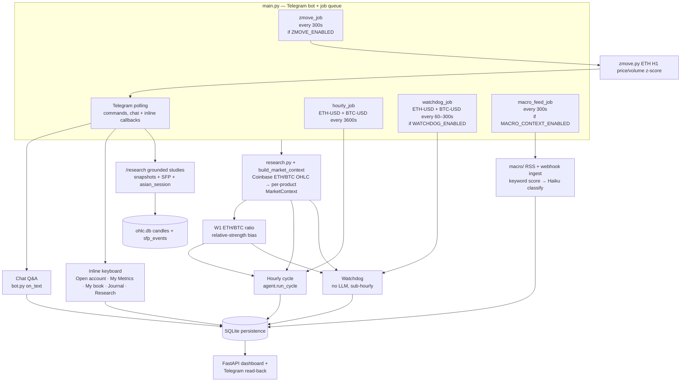
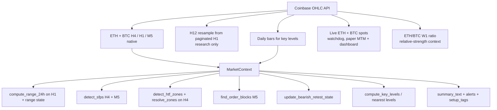
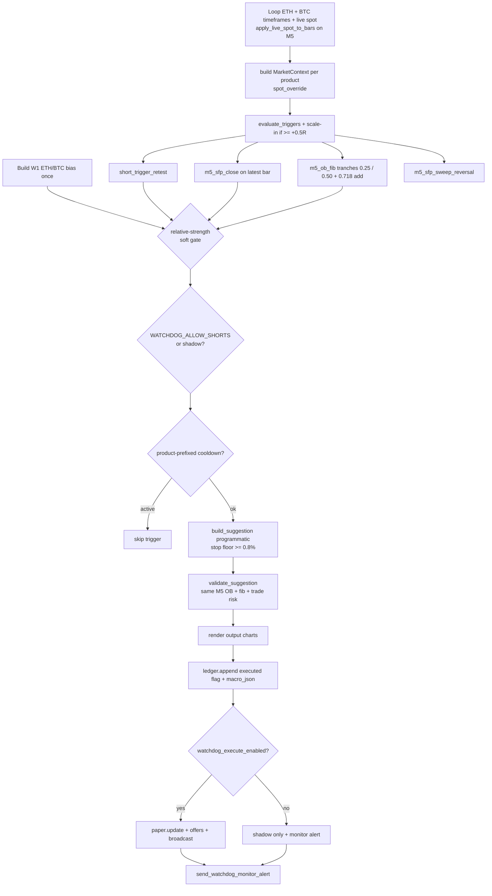
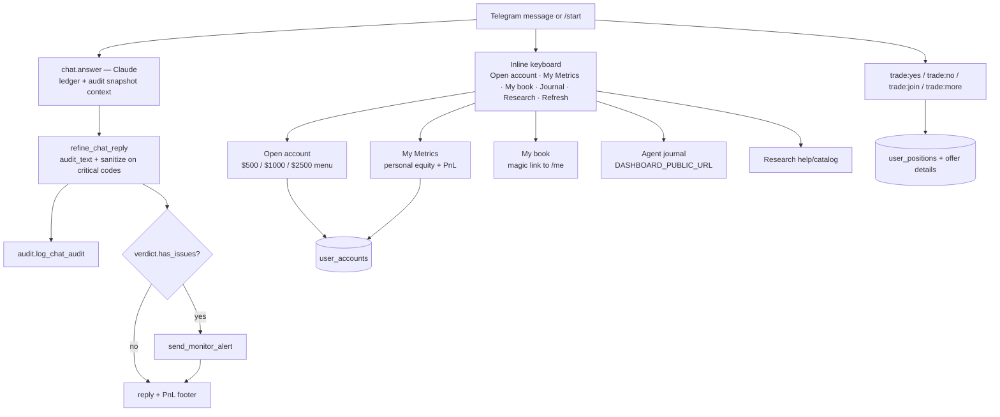
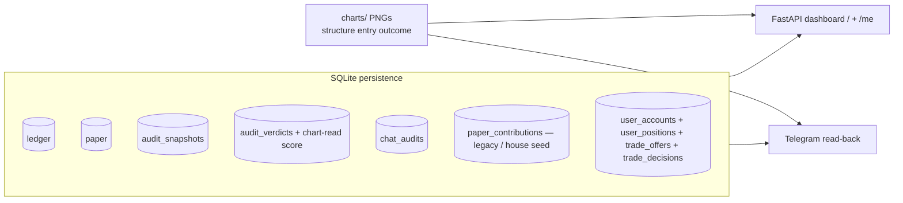

# Project state

> Single source of truth for architecture and status of the Telegram trading bot.
> See **Documentation maintenance** below — update this file (and related deploy docs) whenever behaviour changes.

**Last updated:** 2026-09-01

---

## Documentation maintenance

When you implement a change that affects architecture, runtime behaviour, config flags, deployment, or ops workflows, **update the relevant docs in the same PR/commit** — do not leave them stale.

| If you changed… | Update… |
|---|---|
| Agent flow, validation, audit, watchdog, chat, persistence, dashboard | `deploy/PROJECT_STATE.md` — diagrams, status table, config table, changelog |
| VPS setup, systemd, `.env`, subscriber onboarding, dashboard HTTPS, deploy scripts | `deploy/CLOUD.md` |
| New/changed deploy script, service unit, or one-off ops tool | The script **and** a short note in `deploy/CLOUD.md` (and changelog here if architectural) |
| `bot_config.py` tunables | Section 9 below **and** any CLOUD.md mention of that flag |

**Checklist before merging:**

- [ ] Status table and changelog reflect the change
- [ ] Mermaid diagrams still match the code path (hourly, watchdog, chat, persistence)
- [ ] Config defaults in section 9 match `bot_config.py`
- [ ] CLOUD.md updated if deploy or server ops steps changed

Related deploy docs: [`CLOUD.md`](CLOUD.md) · `setup.sh` · `update.sh` · `eth-agent.service` · `eth-dashboard.service`

---

## 1. What this system is

A Telegram bot that runs an hourly dual-asset LLM trading cycle and a sub-hourly dual-asset programmatic watchdog over Coinbase ETH-USD and BTC-USD data. W1 ETH/BTC relative strength biases asset selection and soft-gates watchdog entries. Every suggestion is validated and audited before broadcast, then applied to a **house/agent paper book** (public journal). Subscribers hold **separate personal demo accounts**; trade DMs include a decision chart plus Accept/Reject — only Accept (or a later missed-connection Join) puts that user's cash into the trade. Personal ledgers are on `/me` (Telegram magic link). State is persisted to SQLite and surfaced through a FastAPI dashboard and Telegram read-back.

Four operator-facing paths (hourly, watchdog, Telegram chat/inline UI, dashboard), one shared data/context layer, one house paper book, and per-user personal books.

---

## 2. Top-level architecture



---

## 3. Data + market context layer

`research.py` pulls ETH-USD and BTC-USD feeds from Coinbase; `patterns/market_context.py` → `build_market_context` assembles one `MarketContext` per product. `patterns/relative_strength.py` aligns weekly ETH and BTC bars into an ETH/BTC ratio, detects nearby W1 zones/SFPs, and infers `eth_strong`, `btc_strong`, or `neutral`. The hourly proposal receives that context as an asset preference; the watchdog rejects only entries that clearly fight it (long weaker asset or short stronger asset), so it remains a soft gate rather than a standalone signal.

Live strategy timeframes: **H4 → H1 → M5**. H12 remains available for research/historical studies only.



---

## 4. Hourly vision cycle (`agent.run_cycle`)

The LLM path builds both products plus W1 ETH/BTC context in one proposal call, then validates, refines, persists, and broadcasts each actionable product independently.

```mermaid
flowchart TD
    D1[ETH + BTC timeframes + daily bars] --> CTX[build MarketContext per product]
    CTX --> CH1[render marked ETH + BTC<br/>H4/H1/M5 charts]
    D1 --> RS[build + render W1 ETH/BTC ratio]
    CH1 --> PT[propose_trades_multi — Claude<br/>both assets + ratio + contexts]
    RS --> PT

    PT --> V1{_validate in analyze.py}
    V1 -->|trade| V1a[M5 OB + fib zone match]
    V1a --> V1b[validate_trade_risk — validate.py<br/>stop dist, R/R, sizing]
    V1 -->|no_trade / parse_error| S0[Suggestion]
    V1b -->|pass/fail| S0

    S0 --> REF[refine_suggestion — critic.py<br/>pre-broadcast audit loop]
    REF --> FD[verify_deterministic]
    REF --> FL[verify_llm critic<br/>if RUN_LLM_CRITIC_PRE_BROADCAST]
    FD --> OK{findings require refine?}
    FL --> OK
    OK -->|yes, passes left| RETRY[propose_trade retry<br/>with audit_feedback]
    RETRY[propose_trade single-product retry<br/>with audit_feedback] --> REF
    OK -->|exhausted passes| DOWN[downgrade / sanitize → no_trade]
    OK -->|no| CR[compose_rationale<br/>thesis then Market context]
    DOWN --> CR

    CR --> OC[build_output_charts]
    OC --> LG[ledger.append + paper.update]
    LG --> SNAP[audit.save_snapshot]
    SNAP --> MON[audit_hourly_cycle<br/>monitor verdict, run_llm=False]
    MON --> MRPT[send_hourly_monitor_report]
    LG --> BC{BROADCAST_ONLY_TRADES<br/>and no_trade?}
    BC -->|skip| SKIP[no subscriber DM]
    BC -->|send|     OFFER[user_books.create_trade_offer]
    OFFER --> SUM[display_summary deterministic blurb<br/>optional LLM if USE_LLM_DISPLAY_SUMMARY]
    SUM --> BDM[notify.broadcast<br/>decision chart + concise card<br/>Accept/Reject/See more]
    BDM --> XT[twitter_post.announce_hq<br/>same decision chart image]
```

---

## 5. Watchdog (`watchdog.run_watchdog`) — no LLM, sub-hourly



Default: **scan on, paper execute off** (`WATCHDOG_EXECUTE_ENABLED=False`). Operators flip execute via dashboard `/api/ops/watchdog-execute` (Bearer `MACRO_WEBHOOK_SECRET`) or Telegram `/watchdog on|off`. Shorts stay shadow-only while `WATCHDOG_ALLOW_SHORTS=False`.

---

## 6. Telegram chat + inline UI (`bot.py`, `telegram_ui.py`)



`Open account` creates a one-time personal demo book (not real funding). Legacy Funders are migrated to a **$1,000** personal account via `user_books.migrate_funders_to_personal_accounts` (also on `paper.init_db`). The house/agent book in `paper.py` continues to auto-take every validated trade for the public journal; user cash never mixes into house equity. Trade broadcasts send a **concise decision card** (decision chart + friendly caption with price-move % to TP1/SL, Accept/Reject/See more). Full canonical rationale and structure/entry charts are deferred to **See more**. Rejected/expired users may get one missed-connection Join invite when the house position is ≥ +0.5R.

---

## 7. Persistence + read consumers



Writers → stores:

| Store | Written by | Read by |
|---|---|---|
| `ledger` | hourly cycle, watchdog | dashboard, Telegram |
| `paper` | hourly cycle, watchdog | dashboard, Telegram |
| `paper_contributions` | House seed; legacy Fund rows (migration source) | Migrate script; house seed |
| `user_accounts` / `user_positions` / `user_trades` | Open account; Accept / late-join | Telegram My Metrics; `/me` |
| `trade_offers` / `trade_decisions` | Hourly + watchdog after house `paper.update`; `display_summary` sibling field; offers immutable after create | Accept/Reject/See more; participation strip; missed-connection |
| `audit_snapshots` | hourly cycle | dashboard, chat, monitor |
| `audit_verdicts` | hourly monitor, chat audit | dashboard |
| `chat_audits` | chat Q&A | — |
| `charts/` PNGs | hourly/watchdog output charts; `paper` close → `{cycle}_H4|M5_outcome.png`; HQ live close → `case_study_hq_{id}.png` | dashboard `/api/chart`, `/api/live-chart/{id}`, Telegram |

---

## 8. Component status

Legend: ✅ done · 🟡 in progress · 🔧 needs work · ⬜ planned · ⚠️ known issue

| Component | File(s) | Status | Notes |
|---|---|---|---|
| Coinbase OHLC ingest | `research.py` | ✅ | H4/H1/M5 live; H12 resample research-only; daily; live spot |
| Market context | `patterns/market_context.py`, `patterns/relative_strength.py` | ✅ | per-product alerts/tags/summary plus W1 ETH/BTC bias |
| SFP detection | `patterns/sfp.py` | ✅ | H4 + M5 (live); H12 still used in research |
| HTF zones | `patterns/htf_structure.py`, `patterns/zone_resolver.py` | 🟡 | detect_zones on H4; resolve_zones tuning |
| Order blocks | `patterns/order_block.py` | 🟡 | M5 OB + fib matching |
| 24h range | `patterns/range_24h.py` | ✅ | computed on H1 bars |
| Bearish retest state | `patterns/setup_state.py` | ✅ | |
| Hourly cycle | `agent.py` | ✅ | dual ETH/BTC contexts, charts, per-product persistence/broadcast |
| Trade proposal (LLM) | `analyze.py` | ✅ | one 0–2 trade multi-asset call; single-product critic retries; pattern PNGs off by default |
| Trade risk validation | `validate.py` | ✅ | stop dist, R/R, USD-notional sizing |
| Refine / critic loop | `critic.py` | ✅ | pre-broadcast retries; context-conflict ack; thesis + Market context compose; post-cycle monitor |
| Watchdog | `watchdog.py` | ✅ | loops ETH/BTC; one fire/product/tick; product cooldown; macro + ETH/BTC soft gates |
| Macro context | `macro/` | ✅ | RSS poll, webhook ingest, keyword→`ANTHROPIC_MODEL_FAST` classify/pulse, dashboard |
| OHLC history vault | `ohlc_cache.py`, `backfill.py` | ✅ | ETH+BTC H1/D1 cache; W1/H12 derived; `--product` CLI |
| SFP pattern index | `patterns/sfp_index.py` | ✅ | deterministic `sfp_events` in ohlc.db; rebuild on backfill/study |
| Chat Q&A | `bot.py`, `chat.py` | ✅ | snapshot-grounded + chat audit |
| Telegram research | `research_reports/`, `metrics/`, `analytics.py` | ✅ | `/research` catalog; snapshots + asian_session; d1/w1/h12 SFP + invalidations; ETH/BTC |
| Z-Move alerts | `zmove.py` | ✅ | ETH H1 \|z\|≥2 price/volume → subscriber broadcast + cooldown |
| Persistence | `ledger.py`, `audit.py`, `paper.py`, `user_books.py` | ✅ | SQLite |
| Paper trading | `paper.py` | ✅ | house multi-asset book; fixed 25% deploy; qty caps; FIFO; staged TP scale-out; outcome charts |
| Personal books | `user_books.py` | ✅ | open-account sizes; offers; Accept/Reject/expire; late-join; user SL/TP; `/me` tokens; `display_summary` on offers |
| Telegram beta UI | `bot.py`, `telegram_ui.py`, `display_summary.py` | ✅ | Open account / My Metrics / My book / Journal / Research; trade Yes/No/Join/See more; concise cards (deterministic blurb by default) |
| Decision chart | `charts.build_decision_chart` | ✅ | clean candles + red SL / green TP1 bands with % annotations; source/SL/TP-reference-aware M5 history (up to 300 bars) |
| Dashboard | `dashboard/` | ✅ | Intelligence hub: Brain (vision) · Eva Trades (HQ ICT live + paper) · Yield Generation · Trade mill (idea stream + nano-ETH live clip). Consumer `/feed` + `/me` |
| Investor view | `dashboard/investor.py`, `templates/investors.html` | ✅ | Private `/investors` link: Eva portfolio value with week/month/year chart, realized day/YTD, unrealized, Coinbase-style account-health pill (whole-account margin usage, red ≥80%), every open Eva position (size + liq price), per-day P&L (`% of position` = return on traded notional; Exits = booking events), annotated case-study chart on closed cards. Token-gated via `INVESTOR_ACCESS_TOKEN`, `noindex`, unlinked from the hub |
| Eva case study | `case_study.py` | ✅ | On HQ live close, render a dark TradingView-style annotated PNG (entry / stop / TPs / discretionary post-trade note). Original entry rationale is the first LLM input. Fail-soft; mill skipped. Shown in the closed-trade dropdown on Eva Trades and `/investors` |
| Live execution | `execute.py` | ⬜ | shadow/live path not built |
| OHLC history cache | `ohlc_cache.py` | ✅ | research/backfill; ETH+BTC H1/D1; not hot path |
| Legacy scheduler | `scheduler.py` | ⚠️ | deprecated; use `main.py` |

---

## 9. Feature flags / config

Defaults from `bot_config.py` (non-secret tunables). Secrets and portfolio size live in `.env` — see `CLOUD.md`.

| Flag / setting | Default | Effect |
|---|---|---|
| `WATCHDOG_ENABLED` | `True` | enables sub-hourly watchdog **scan** job |
| `WATCHDOG_EXECUTE_ENABLED` | `False` | paper fills + subscriber offers when True; else shadow-log only (runtime override via meta / dashboard / `/watchdog`) |
| `WATCHDOG_ALLOW_SHORTS` | `False` | when False, short triggers are shadow-logged only |
| `SCALE_IN_MIN_R` | `0.5` | scale-in requires unrealized ≥ this many R |
| `WATCHDOG_INTERVAL_SEC` | `60` | scan cadence (clamped 60–300s in `main.py`) |
| `WATCHDOG_COOLDOWN_SEC` | `1800` (30m) | suppress repeat fire on same M5 OB |
| `BROADCAST_ONLY_TRADES` | `True` | suppress `no_trade` subscriber DMs |
| `RUN_LLM_CRITIC_PRE_BROADCAST` | `False` | run LLM critic in refine loop (deterministic critic always runs) |
| `MAX_REFINE_PASSES` | `1` | audit retry budget before downgrade |
| `INCLUDE_PATTERN_IMAGES` | `False` | attach Trading Guide reference PNGs to vision calls |
| `USE_LLM_DISPLAY_SUMMARY` | `False` | LLM trade-card blurbs; else deterministic setup blurb |
| `CASE_STUDY_ENABLED` | `True` | generate annotated close charts for Eva (HQ) live trades |
| `USE_LLM_CASE_STUDY` | `True` | Haiku writes callout copy from the entry rationale + ledger facts; off = deterministic sentences |
| `MAX_OPEN_TRADES` | `20` | paper FIFO cap |
| `ENTRY_FIB_LOW` / `ENTRY_FIB_HIGH` | `0.25` / `0.50` | M5 OB entry band; watchdog tranches at each level |
| `ADD_FIB_LEVEL` | `0.718` | scale-in adds another `TRADE_DEPLOY_PCT` (1.25× max base exposure) |
| `ENTRY_TRANCHE_DEPLOY_PCT` | `0.125` | per-tranche deploy (half of `TRADE_DEPLOY_PCT`) |
| `TRADE_DEPLOY_PCT` | `0.25` | fixed fraction of **live paper equity** deployed as notional per full idea (R/R unaffected) |
| `FIB_LEVEL_TOLERANCE_PCT` | `0.008` | looser "near" fib mark for M5 watchdog |
| `TRADED_PRODUCTS` | `("ETH-USD", "BTC-USD")` | products the hourly cycle and watchdog may trade concurrently |
| `PRODUCT_QTY_CAPS` | `{"ETH-USD": (0.25, 2.0), "BTC-USD": (0.005, 0.05)}` | per-product paper size guardrails used by `qty_caps(product_id)` |
| `MIN_ETH_QTY` / `MAX_ETH_QTY` | `0.25` / `2.0` | legacy aliases for the ETH entries in `PRODUCT_QTY_CAPS` |
| `RELATIVE_STRENGTH_ENABLED` | `True` | adds W1 ETH/BTC proposal bias and watchdog soft gate |
| `PAPER_CONTRIBUTION_USD` | `1000.0` | legacy default / migrate amount alias |
| `PAPER_ACCOUNT_SIZES` | `(500, 1000, 2500)` | Open account menu sizes |
| `PAPER_ACCOUNT_DEFAULT_USD` | `1000.0` | migrate amount for legacy Funders |
| `APPROVAL_WINDOW_MIN` | `15` | Accept window before pending → expired |
| `MISSED_CONNECTION_R` | `0.5` | house unrealized R to trigger late-join DM |
| `USER_MIN_DEPLOY_USD` | `25.0` | minimum notional to Accept / late-join |
| `HOUSE_CONTRIBUTION_TELEGRAM_ID` | `0` | reserved Telegram ID for the house seed row in `paper_contributions` |
| `OB_MIN_WIDTH_PCT` | `1.25` | default / ETH HTF (H4) OB zone width floor (% of mid price) |
| `PRODUCT_OB_MIN_WIDTH_PCT` | `{"ETH-USD": 1.25, "BTC-USD": 0.60}` | per-product HTF OB/breaker width via `ob_min_width_pct(product_id)` |
| `OB_MIN_WIDTH_PCT_M5` | `0.15` | minimum M5 entry OB width (M5 candles are ~10× thinner than H1) |
| `PAPER_EPOCH_LABEL` | `"5k_usd"` | dashboard epoch label |
| `MACRO_CONTEXT_ENABLED` | `True` | RSS poll + macro advisory injection |
| `MACRO_POLL_INTERVAL_SEC` | `300` | RSS poll cadence |
| `MACRO_MIN_SEVERITY_INJECT` | `3` | min LLM severity for prompt injection |
| `MACRO_PULSE_MIN_SEVERITY` | `4` | position-aware pulse + mechanical house `tighten_sl` |
| `MACRO_WATCHDOG_GATE_MIN_SEVERITY` | `4` | soft gate conflicting watchdog entries (not raised after audit) |
| `MACRO_LLM_PROMOTE_THRESHOLD` | `40` | min keyword_score before Haiku classify |
| `MACRO_DEFAULT_TTL_HOURS` | `24` | fallback TTL for classified events |
| `ZMOVE_ENABLED` | `True` | ETH H1 price/volume z-score subscriber alerts |
| `ZMOVE_INTERVAL_SEC` | `300` | z-move scan cadence |
| `ZMOVE_THRESHOLD` | `2.0` | \|z\| fire threshold |
| `ZMOVE_LOOKBACK_H` | `168` | hourly lookback for mean/std |
| `ZMOVE_COOLDOWN_SEC` | `7200` | per-metric suppress window after fire |
| `ZMOVE_PRODUCT_ID` | `"ETH-USD"` | product scanned for z-moves |
| hourly interval | `3600s` | `hourly_job` cadence in `main.py` (wall-clock aligned to the top of the hour) |
| `validate.MIN_STOP_DISTANCE_PCT` | `0.008` (0.8%) | hard floor on stop distance (LLM + watchdog) |
| `INTELLIGENCE_ENABLED` | `True` | hourly BTC/ETH stance batch (H4/H1/M15) persisted + served on `/api/v1` |
| `HQ_IDEAS_INTERNAL_ONLY` | `False` | HQ (abstention-first ICT) cards now DM **all public subscribers** with Accept/Reject and a "High Quality" title label (2026-08-12); set `True` to gate back to `INTERNAL_TELEGRAM_IDS`. Ledger + house paper book record every idea either way |
| `DAILY_PERFORMANCE_POST_ENABLED` | `True` | once-daily performance digest ("you'd be up X%" + winner breakdown) posted as an X thread and mirrored to Telegram subscribers |
| `DAILY_DIGEST_HOUR_UTC` | `21` | daily digest post time (UTC) |
| `TWITTER_ENABLED` (env) | `false` | X announcement mirror for HQ cards + daily digest (OAuth 1.0a keys in `.env`; announcement-only, no Accept/Reject on X). HQ and mill tweets attach the Telegram decision chart when it rendered. The trade_ideas mill mirrors its broadcast idea cards with the same keys |
| `FUNDING_ENABLED` | `True` | perp funding regime tracker (Binance prints for BTC/ETH) |
| `FUNDING_INTERVAL_SEC` | `3600` | funding refresh cadence (prints land every 8h) |
| `FUNDING_PERSIST_PERIODS` | see `bot_config` | prints required before a regime counts as persistent |
| `FUNDING_SWITCH_CONFIRM_PERIODS` | see `bot_config` | prints required to confirm a first switch (chop is suppressed) |
| `LONG_THESIS_ENABLED` | `True` | daily BTC 4-year-cycle thesis + annotated chart |
| `LONG_THESIS_INTERVAL_SEC` | `86400` | long thesis refresh cadence |
| `LIVE_HQ_EQUITY_USD` | `2000.0` | HQ ICT live margin sleeve |
| `LIVE_TRADE_DEPLOY_PCT` | `0.50` | 50% of HQ sleeve per idea ($1,000) |
| `LIVE_MAX_OPEN_HQ` | `2` | skip new HQ live ideas when full |
| `LIVE_DAILY_LOSS_LIMIT_USD` | `160.0` | HQ live halt until next UTC day |
| `LIVE_MILL_SLEEVE_USD` | `1400.0` | mill live clip sleeve (same Coinbase account, partitioned); funded +$1,000 on 2026-08-28 |
| `LIVE_PRODUCT_QTY_FLOORS` | ETH `0.1` / BTC `0.01` | mill clips are **always one** of these (one CDE nano). Notional is qty × mark. A contract that no longer fits the sleeve is rejected. HQ still sizes as % of `LIVE_HQ_EQUITY_USD` |
| `LIVE_MILL_MAX_OPEN` | `3` | mill live open-position cap |
| `LIVE_MILL_MAX_FILLS_PER_DAY` | `0` | mill live daily fill cap; `0` = none (sleeve / open / daily loss still bind). Closed clips free the slot for the next mint |
| `LIVE_MILL_DAILY_LOSS_LIMIT_USD` | `112.0` | mill live halt until next UTC day (8% of sleeve, same ratio as HQ) |
| `LIVE_MILL_AUTO_FILL_ENABLED` | `True` | FIFO self-fill so the book is never empty; set `False` to make every clip operator-driven |
| `LIVE_MILL_AUTO_MIN_CONFIDENCE` | `0.5` | conviction floor for a self-fill. Admits news (0.6), funding (0.6), spike (0.625+), zmove (0.5+), cascade (0.5); excludes session-open cards (0.4). Manual Accepts bypass it |
| `LIVE_MILL_FILL_TELEGRAM_IDS` | 2 ids | Telegram ids whose **Accept** takes a real clip. Everyone else's Accept stays paper-only |
| `LIVE_FILL_ALERTS_ENABLED` | `True` | push a Telegram card on every live open **and** close (both sleeves). Off = fills are only discoverable in the log |
| `LIVE_ALERT_TELEGRAM_IDS` | = `LIVE_MILL_FILL_TELEGRAM_IDS` | extra chats for fill/close/halt alerts, on top of `TELEGRAM_ADMIN_CHAT_ID`. De-duped; one unreachable chat never silences the others |
| `LIVE_REVALIDATE_ON_FILL` | `True` | re-check an idea's levels against the live mark before any money moves. Fails **open** when no mark can be read, so a ticker outage is not a trading outage |
| `LIVE_MAX_CHASE_R` | `0.5` | how far price may run past the entry, in units of planned risk, before an Accept is refused as `chased` |
| `LIVE_MIN_FILL_RR` | `1.0` | reward:risk floor for the re-anchored plan, measured against the **average of the targets still ahead** — not TP1, which a scale-out ladder puts close in on purpose |
| `LIVE_TP_MIN_EDGE_PCT` | `0.1` | a target nearer the mark than this is dropped rather than rested |
| `IDEA_EXPIRY_MINUTES` | `15` | how long a posted card stays acceptable; past it the idea is marked `expired` and a late Accept is refused. `0` disables |
| `LIVE_MILL_REOFFER_ENABLED` | `True` | when a mill clip closes, replay the recent backlog to refill the sleeve instead of waiting for the next mint |
| `LIVE_MILL_REOFFER_MAX_AGE_MIN` | `120` | sweep lookback. Deliberately longer than `IDEA_EXPIRY_MINUTES`, and **expired cards are still swept**: expiry governs what a person may tap Accept on, while the sweep re-prices against the live mark first. At ~20-30 fillable mints/day a 15-minute lookback would find nothing in most windows |
| `INVESTOR_ACCESS_TOKEN` (env) | unset | gate for the private `/investors` link. Set → the page and `/api/investors/snapshot` require `?k=<token>` once and then ride an httponly cookie; anything else **404s** (not 401, so a guess never confirms the page exists). Unset → the page stays reachable but unlisted, the same posture as `/volume` |
| `INVESTOR_SESSION_TTL_SEC` (env) | `2592000` (30d) | lifetime of the investor cookie once the token has been presented |

---

## 10. Known issues / open questions

- [x] Live execution path (`execute.py`) implemented and **armed** — `EXECUTION_MODE=live` as of 2026-08-28
- [ ] **`EXECUTION_MODE` is global, not per-lane.** `live` arms the HQ hourly sleeve ($1,000/idea, 2 open) *and* the mill sleeve together; only the watchdog has its own gate (`WATCHDOG_LIVE_ENABLED`). Adding a `LIVE_HQ_ENABLED` gate would let the two lanes be armed independently
- [ ] **`halt_live()` writes one global `live_halt` key.** An HQ daily-loss halt ($160) also pauses mill fills, and vice versa ($112). Per-sleeve halts would need separate keys
- [x] ~~**The auto/FIFO path gets exactly one chance per idea, at mint.**~~ Closed 2026-08-31 by `trade_ideas_bridge.sweep_reoffer`, called from `_close_out` whenever a mill clip closes: the freshest qualifying ideas are replayed through `execute_mill_idea` as auto fills, so the sleeve no longer sits idle waiting for a brand-new mint. The mill still only offers once at mint (its own code is not deployable), but the hub now re-offers on its own
- [ ] **The mill's clip is always exactly one contract, so it can never scale out.** `_mill_clip` sizes to `LIVE_PRODUCT_QTY_FLOORS` (0.1 ETH / 0.01 BTC) and `_tp_ladder` then puts the whole clip on TP1. Mill clips are therefore all-or-nothing and the stop trail never engages on them; only HQ's larger clips ladder. Raising mill size to 2–3 contracts is what would make its exits behave like HQ's
- [ ] **Sleeve sizes are constants, never reconciled against the broker.** `LIVE_MILL_SLEEVE_USD` / `LIVE_HQ_EQUITY_USD` are trusted blindly by the exposure checks; nothing compares them to `get_account_summary()`. Funds sitting in the spot/USDC wallet rather than the CFM futures wallet are invisible to the bot, so clips can be sized against capital the account does not have. `deploy/diagnose_live.py` reports the real futures cash — the **sizing path still uses the constants**
- [ ] **Investor gain % assumes no deposits or withdrawals.** With a live balance the page derives its capital base by stripping YTD realized and the open mark out of today's equity. Any funding event (the mill sleeve was topped up $1,000 on 2026-08-28) silently shifts that base, which is why every percentage is labelled an estimate. A dated `live_nav_snapshots` table, or a manual deposits ledger, is what would make it exact
- [ ] **`/opt/trade-ideas` on the VPS is not a git repo**, so the mill's own changes cannot be deployed with `git pull` and are shipped hub-side only. Behaviour stays correct because every real limit is enforced in `execute.execute_mill_idea`. This bit once: `ideas.live_fill_type` / `live_filled_by` were added to the mill's `store.py` on 2026-08-28 but never reached the server, so every hub write to them failed silently until `trade_ideas_bridge._ensure_hub_columns` started adding them on connect (2026-08-31). Any *new* column the hub needs on `ideas` must go in `_HUB_COLUMNS`, not just in the mill's schema
- [ ] **Exit reconciliation is poll-based, at watchdog cadence.** A bracket leg that fills is only booked on the next `sync_live_positions` pass, so the ledger and dashboard lag the exchange by up to one loop. Acceptable while brackets are position-sized (they cannot flip the account), but a websocket user-channel feed would make fills immediate
- [ ] **A partial shortfall between the exchange and the ledger is not auto-resolved.** Because HQ and mill net into one contract, `_reconcile_flat_instrument` can attribute a *full* flatten but not a partial one; it logs `unattributed shortfall, needs review` and leaves both rows open. Watch for that line
- [ ] **HQ's second slot is BTC-only in practice.** `vault.policy()` pins `max_per_product=1` and only ETH/BTC are traded, so while Eva holds ETH the remaining slot can only be filled by a BTC setup. Raising `LIVE_MAX_OPEN_HQ` past 2 changes nothing on its own. Not currently costing fills (zero `Vault skip` lines), but `grep 'Vault skip: max_per_product'` is the signal that it has started to
- [ ] HTF zone / M5 OB resolver edge cases under active tuning
- [ ] Ops: flatten oversized open watchdog BTC shorts if still live after deploy (audit risk control)

---

## 11. Changelog

| Date | Change |
|---|---|
| 2026-09-01 | **Stop trails to the last filled target, not one rung behind.** After TP1 the runner's stop sits at TP1; after TP2 it sits at TP2 (`execute._trailed_stop`, `paper._sl_after_tp_hit`). The previous one-behind trail (breakeven after TP1, TP1 after TP2) let Eva #8's remaining 0.2 retrace from TP2 back to TP1 and bank $18 instead of the ~$25 locking TP2 would have kept. A retrace through the last paid target now closes the runner there. Paper, live, and Telegram position copy all use the same rule. |
| 2026-09-01 | **Coinbase-style account health pill + case-study callouts hug their dots.** The big collateral-vs-exposure "Health factor" card on `/investors` is gone; a small pill in the header corner now shows whole-account margin usage the way Coinbase frames it — `liquidation_threshold / available_margin` from `cfm/balance_summary` (mill included), 0% idle, 100% forced close, amber ≥60%, red ≥80% (`dashboard/account.py:build_account_health`, refreshed by the snapshot poll). `n/a` when no exchange read (`EXECUTION_MODE=off`). Case-study annotation boxes stopped using fixed corner anchors that dragged leader arrows across the whole chart: level callouts (TPs, exits, stop-outs) park at the left edge vertically aligned with their price line and point at the near end of that line; entry/stop/post-trade boxes sit beside their own dots, with vertical nudging to dodge neighbours. Y-limits now include every annotated level so a never-touched stop below the traded range is not silently clipped. |
| 2026-09-01 | **Investor daily table + ladder reporting + case-study candles.** Daily P&L `% of position` is return on that day's traded notional (entry × qty), not `% of` the $2,000 sleeve — those sleeve % stay on the four headline numbers. Dropped the redundant Closed and Wins columns (Exits already counts booking events; closed trades have their own section). **TP pips and the case-study chart now follow fill prices**, not the count of `take_profit` tags: a profitable stop that had trailed to TP1 was lighting TP3 on the card *and* would have been drawn as a third target on the annotated PNG. Reconcile classifies fills from the bracket's limit vs stop trigger, not P&L sign. Opening-stop display recovers from the cycle plan when `initial_stop_loss` was backfilled from an already-trailed stop. Case-study OHLC windows are clamped to now — Coinbase 400s on a future `end`, which is why the first Eva close chart never rendered. |
| 2026-09-01 | **Eva closed-trade case-study charts.** When an HQ live trade fully closes, `case_study.py` renders a dark TradingView-style annotated PNG (entry, opening stop, each take-profit that paid, full exit, discretionary post-trade note) and stores `live_trades.case_study_path`. The original entry rationale is the first input to copy generation — Haiku condenses that thesis rather than inventing a new one; numbers stay on the ledger. Fail-soft and threaded so `_close_out` never waits. Mill clips are skipped. The figure appears only on closed-trade dropdowns (Eva Trades tab and `/investors`), via `/api/live-chart/{id}`. Watchdog backfills at most one missing chart per scan. Flags: `CASE_STUDY_ENABLED`, `USE_LLM_CASE_STUDY`. |
| 2026-08-31 | **Investor page chart + no paper books.** Portfolio at a glance now opens with an Eva NAV sparkline (week / month / year). The series is the $2,000 sleeve plus realized P&L each UTC day; today's point includes the open mark. Dropped the v1/v2 paper journals from this page — they belong on the operator hub. |
| 2026-08-31 | **Investor page is Eva-only and no longer mirrors Coinbase.** Dropped the exchange-account card (USD equity, buying power, Coinbase realized) — those numbers are a different book (mill + fees + USDC/USD wallets) and read as if Eva were wrong. Health factor no longer shows Coinbase's 1000% liquidation buffer. Open rows now show remaining size (ETH and $ notional) and liquidation price (`n/a` when Coinbase is not quoting one). |
| 2026-08-31 | **Mill clips are always one nano contract.** Dropped `LIVE_MILL_NOTIONAL_USD` ($260 target / price, then round up). `_mill_clip` now sizes to `LIVE_PRODUCT_QTY_FLOORS` (0.1 ETH / 0.01 BTC); notional is qty × mark. Sleeve check still rejects a BTC contract that no longer fits. Telegram Accept replies say `1 contract (0.1)` rather than a pre-floor request like 0.104565. |
| 2026-08-31 | **Investor view is Eva-only.** Mill clips share the Coinbase account but are a different product; `/investors` now filters live trades, daily P&L, health, and portfolio value to the HQ sleeve (`LIVE_HQ_EQUITY_USD`). Whole-account Coinbase equity stays on the exchange card, labelled as shared. |
| 2026-08-31 | **Private investor view at `/investors`, plus TP/stop reporting everywhere.** A shareable read-only page for people who are not operators: portfolio value, realized gain for the day and year to date, unrealized, and every open position, with the four headline numbers set above the fold. Adds the **health factor** — equity over the total size of every open position, so $1.4k of collateral behind $4.2k of exposure reads 33% and 3x rather than a bare notional figure — alongside Coinbase's own liquidation buffer. `dashboard/account.py` is the first non-diagnostic caller of `get_account_summary()`; it memoizes for 60s and falls back to the configured sleeves when credentials are absent, so the page still renders with `EXECUTION_MODE=off`. `live_ledger.get_realized_by_day()` books closed rows on their close date and scale-out legs on the day each leg filled, so the day column reconciles with `get_live_performance`. **Ladder state is now visible on every journal card, hub included**: the live book has no tp1/tp2/tp3 columns (a target hit is a booked exit leg) and `stop_loss` is overwritten in place on every trail, so `data.build_tp_progress` counts the legs and `data.build_stop_state` compares the current stop against the level armed at open — previously "TP2 hit, stop at breakeven" was in the database but nowhere on screen. New column `live_trades.initial_stop_loss`, written by `record_open` and backfilled from `stop_loss` (migration runs in `live_ledger.init_db`, which `deploy/update.sh` already calls). The originating suggestion is not a substitute: Accept-time revalidation re-anchors the stop, so the planned level and the armed level routinely differ, and comparing against the plan would report a trail that never happened. The `trade_card` macro moved to `templates/_macros.html` so the hub and the investor view cannot drift. Gated by `INVESTOR_ACCESS_TOKEN`; 404s rather than 401s so a forwarded URL gives nothing away. |
| 2026-08-31 | **The sweep also runs whenever the mill sleeve is empty**, not only on clip close — a flatten, or a close while the service was down, empties the sleeve too, and "keep a clip open" is the whole objective. Guarded by a one-time floor (`live_meta.mill_reoffer_floor`, set on first run): arming the sweep, or restarting after downtime, must not replay an inherited backlog and fill the oldest thing that still happens to validate. Skipped without a DB read while the sleeve is occupied. |
| 2026-08-31 | **Ideas now expire, and a closed clip refills the sleeve.** Two gaps behind "the mill isn't always holding a trade". (1) `trade_ideas_bridge.expire_stale_ideas`, run every watchdog scan, marks cards older than `IDEA_EXPIRY_MINUTES` as `expired` — nothing previously retired a card, so silence was an offer that never closed and an Accept hours later filled a dead setup. Ideas with an `accept` decision or an existing live fill are never expired; a late Accept now gets an "expired" reply and stays paper-only. (2) `sweep_reoffer`, called from `_close_out` when a **mill** clip closes, replays the freshest qualifying ideas through `execute_mill_idea` as auto fills, closing the "one chance per idea, at mint" gap noted in section 10. Revalidation is what makes the replay safe — an idea whose price has run away is refused, not chased. Both live hub-side because `/opt/trade-ideas` is not a git checkout. |
| 2026-08-31 | **Accept-time revalidation.** An idea is priced at mint and filled whenever someone taps Accept, so `execute_mill_idea` now re-checks the plan against the live mark before placing anything (both entry paths). The entry always re-anchors to the mark, since that is what a market order gets. If price ran **against** the entry the whole structure shifts with it, so a fixed-notional clip still risks the distance the plan called for rather than quietly risking more; past `LIVE_MAX_CHASE_R` it is refused as `chased`. If price came **toward** the entry the structural stop and targets are kept, so the trade simply risks less. Refusals (`chased`, `stop_breached`, `targets_passed`, `rr_collapsed`) each get operator-facing wording in the Accept reply. |
| 2026-08-31 | **Live stops now trail like the paper ladder.** Live armed a structural stop once and never moved it, so a runner still risked the original stop after a target had paid out — banked profit could be handed straight back. `_maybe_trail_stop` now mirrors `paper._sl_after_tp_hit`: breakeven after TP1, TP1 after TP2, and so on. Because a bracket's stop leg cannot be amended, `retrail_exits` cancels and re-places one rung at a time (so a single tranche, not the whole position, is briefly uncovered) and covers any rung that fails to re-place with a plain stop, halting if even that fails. The trail runs on reconcile and also right after arming, since a gap-through target banks at fill time. Alert: `STOP TRAILED`. |
| 2026-08-31 | **Scale-outs on open trades now count as realized P&L.** `get_live_performance()` summed `pnl_usd` `WHERE status = 'closed'`, so a tranche banked on a still-running trade showed up nowhere: the money had left the position, unrealized dropped by it, and the Realized metric stayed flat. Open rows' `realized_pnl_usd` is now added per sleeve and exposed as `banked_open_usd`; no double count, since `record_close` folds banked partials into `pnl_usd` at close. The Eva live book notes how much of Realized came from scale-outs. |
| 2026-08-31 | **A just-placed market order 404s on lookup — that is not a failed order.** `place_market_order` polled `_fetch_order` to learn the fill price, and the very first read of a fresh order id returns `HTTP 404 NOT_FOUND` (eventual consistency). The exception escaped the poll loop, so the caller believed the order had failed when it had actually executed. Hit live while arming mill clip #7: the 1-contract sell filled at $2,466 and `arm_exits` then tried to protect a position that had already shrunk (rejected by the venue as `ORDER_SIZE_EXCEEDS_BRACKETED_POSITION`, which is what kept the account safe). The poll loop now tolerates lookup failures and retries; if the order is *never* readable it raises "could not be confirmed — it may have filled; reconcile before retrying" rather than the misleading "did not fill". Relatedly, `arm_exits`'s fallback stop now re-reads the exchange and protects the smaller of expected-vs-actual size, so a leg that failed after executing can't cause an oversized stop. |
| 2026-08-31 | **Live take-profits are now exchange-enforced. Previously they did not exist.** `execute.py` placed the entry plus one protective stop, wrote the ladder into `live_trades.take_profits_json`, and never acted on it — that column was written once and read only by the dashboard. The sole close path was `sync_live_positions`, pure reconciliation, so a live trade could only end at its stop or by hand: every closed live trade was a loss (`close_reason=exchange_close`), while paper banked the same setups via its own ladder. Now `execute.arm_exits` rests **one `trigger_bracket_gtc` per target**, each carrying the take-profit *and* the stop, sized in whole contracts (`_tp_ladder`: even split, remainder rides the furthest target; a 1-contract mill clip closes fully at TP1; fewer contracts than targets uses the nearest ones). Targets already through the market are banked immediately at market, mirroring paper's gap-through fills. **`reduce_only` is rejected by this venue** (`REDUCE_ONLY_NOT_ALLOWED_ON_VENUE`) — brackets are used precisely because the venue sizes them against the *unreserved* position instead, which is also why the whole position must not already be reserved by a plain stop. If brackets are refused, arming reverts to the old single full-size stop and the fill alert says targets need manual arming; if that also fails the position is flattened and live halts, as before. |
| 2026-08-31 | **Reconciliation reads exit orders, not net position size — fixes silently-missed partial closes.** HQ and the mill both trade `ETP-20DEC30-CDE`, so Coinbase nets them into one position; the old `if size > 0: continue` check meant one sleeve's stop firing left *both* ledger rows open. `sync_live_positions` now polls each trade's own exit orders and books settled legs through `live_ledger.record_partial_exit`, which is idempotent per order id. New columns: `exit_order_ids_json`, `qty_open`, `realized_pnl_usd`, `exit_fills_json` (`qty_open` backfilled from status). `record_close` folds banked partials into `pnl_usd` so performance reads stay whole-trade. A flat exchange position still closes the remainder at mark (covers manual flattens); a *partial* shortfall across two netted sleeves is logged for review rather than guessed at. Unfilled siblings are cancelled on close and `_sweep_orphan_exits` cancels resting exits no open trade owns — mandatory hazard control given no `reduce_only`. Dashboard marks only `qty_open` and shows Still open / Banked on scaled-out rows. |
| 2026-08-31 | **Eva's live book is now a real journal: same cards as paper, plus the mark it never had.** Supersedes part (2) of the row below. The bespoke `<details>` "Trade logic" row is gone; `data.enrich_live_trades` reshapes live ledger rows for the shared `trade_card` macro, so the live book gets the identical accordion, badge row, chart thumbnail and Structure/Execution figures as the paper journal (`trade_chart_urls` builds the URLs, so a row can't offer a 404). Also fixes **missing unrealized P&L**: `live_ledger.get_live_performance()` sums `WHERE status = 'closed'` only, so an open live position had no mark and no uPnL anywhere on the page — enrichment now marks each open row against `get_live_spots()` (`(mark − entry) × qty × direction`, side-aware, and 0 rather than a phantom profit when the quote is missing) and a new **Unrealized** metric shows the book total. `fill_type` leads the badges so auto-vs-manual is visible at a glance. |
| 2026-08-31 | **Live fills now announce themselves; live book shows its reasoning; sanitize reasons are kept.** Three fixes prompted by "why hasn't Eva fired": (1) every live open and close pushes a Telegram card via `_notify_ops`, which now fans out to `TELEGRAM_ADMIN_CHAT_ID` **plus** `LIVE_ALERT_TELEGRAM_IDS` (de-duped, and one dead chat no longer silences the rest) — previously a real fill only wrote a log line, which is untenable now both sleeves fill unattended. (2) The Eva live book rows on the Trading Log are expandable, reusing the journal's `_trade_story_from_cycle` to show rationale, setup tags, planned stop/targets/R:R and marked charts; chart links are built from `marked_chart_paths` so a row never offers a 404, and mill clips (no `cycle_id`) render unchanged. It was the only book displayed without its reasoning. (3) `critic.refine_suggestion` now carries `sanitize_reasons` into the audit verdict's `score_breakdown_json`, and `compute_chart_read_score` penalises a **downgrade** (a killed trade, −30) more than a bare **sanitize** (prose rewritten on an already-`no_trade` cycle, −10). Both previously cost −30 and the audit re-verifies the *replacement* prose — which is clean by construction — so ~10 ETH cycles a day scored 70 with zero recorded findings and no recoverable cause. Eva's slot caps were deliberately left alone: 27 of 28 cycles were `no_trade` with zero `Vault skip` lines, so `max_per_product=1` was never the binding constraint. |
| 2026-08-31 | **`deploy/diagnose_live.py`** — read-only triage for "nothing is filling". Walks every gate in `execute._execute` order (master switches, global halt, daily-loss budget, `live_trades` migration, mill occupancy, CDP auth + instrument resolution, HQ vault, recent fills) and names the first blocker per sleeve; exits `1` when one is found. Written because `EXECUTION_MODE=off` returns *before* any logging, so a disabled sleeve is indistinguishable from a quiet market in the logs. Also surfaced two standing gaps now tracked in section 10: the auto/FIFO path only gets one attempt per idea (at mint, empty sleeve only), and sleeve constants are never reconciled against the real futures balance. |
| 2026-08-28 | **Live execution armed** (`EXECUTION_MODE=live`) after the mill sleeve was funded to $1,400. Note this is a *global* switch: it arms the HQ hourly sleeve ($1,000/idea, max 2 open, $160 daily loss halt) alongside the mill sleeve ($260–$800 clips, max 3 open, $112 halt). The watchdog stays gated behind `WATCHDOG_LIVE_ENABLED=False`. `deploy/update.sh` now runs `live_ledger.init_db()` so `live_trades` column migrations land before `eth-agent` restarts — the operator Accept path writes that table in-process, ahead of the dashboard's own init. |
| 2026-08-28 | **Mill sleeve redesign — keep a clip open at all times.** Sleeve funded to `$1,400` (+$1,000), `LIVE_MILL_MAX_OPEN=3`, daily loss halt to `$112` (8% of sleeve). Two entry paths now share one gate, `execute.execute_mill_idea`: **auto** (FIFO) fills only while the sleeve is *empty* and only at/above `LIVE_MILL_AUTO_MIN_CONFIDENCE=0.5`, so it can never crowd out the remaining slots; **manual** is an Accept from `LIVE_MILL_FILL_TELEGRAM_IDS`, which skips the conviction floor but still respects open-count, sleeve, and halt. A manual Accept at max replies "Too many trades open" with the open book instead of filling. Mill clips now round **up** to one nano contract instead of skipping — this fixes a live bug where ETH clips silently stopped filling above ~$2,600 spot (a $260 target is 0.087 ETH, under the 0.1 floor) and makes BTC ideas fillable for the first time. New `live_trades.fill_type` / `filled_by` and mill-side `ideas.live_fill_type` / `live_filled_by` distinguish auto from manual; `get_live_performance` reports `by_fill_type`. New `GET /api/v1/execute/mill/capacity`; `POST /api/v1/execute/mill` takes `confidence` / `fill_type` / `accepted_by` and returns `skip_reason` + `capacity`. |
| 2026-08-27 | Eva paper v2: metrics + journal share one card (same layout as v1). July 2026 v2 fills trimmed so the live book / topline start 2026-08-01 (`deploy/trim_paper_july.py`). |
| 2026-08-27 | HQ and mill X posts attach the Telegram decision-chart image (chunked `/2/media/upload`, v1.1 fallback). Text still ships if the upload fails. |
| 2026-08-27 | Eva Trades paper journal: v2 (live) vs v1 (archived) labeled; archived list collapsed like the paper journal; both books show win rate, realized P&amp;L, avg/trade, profit factor. |
| 2026-08-27 | Mill live daily fill cap default **off** (`LIVE_MILL_MAX_FILLS_PER_DAY=0`). Capital is the limiter: when a mill clip closes, the next sized ETH mint can take the sleeve. Daily loss halt and 1x / one-open-at-a-time still apply. |
| 2026-08-27 | Dashboard hub is four product tabs: **Brain** (vision/intelligence), **Trading Log** (HQ live + paper only), **Yield Generation**, **Trade mill** (consumer idea stream + internal nano-ETH live clip book, funnel, house mill paper). `/feed` remains the Telegram consumer page for Accept/Reject. HQ live P&L on Trading Log is no longer blended with mill clips. |
| 2026-08-10 | **Republic Intelligence layer.** This service becomes the always-on intelligence hub feeding two consumers. New `intelligence/` package: wall-clock hourly BTC/ETH stances on H4/H1/M15 (Claude with a deterministic fallback so an artifact always lands), perp funding regime tracker (persistent bull/bear vs chop, first-switch cue), and a daily BTC 4-year-cycle thesis with annotated log chart + gold ratio. New versioned `/api/v1` router (`dashboard/intel_api.py`): stances, history, macro/zmove/funding signals, subscribers, gated HQ ideas, cycle chart — **token-only via `SERVICE_API_TOKENS`, fails closed with 503 when unset**. HQ ICT cards gated to `INTERNAL_TELEGRAM_IDS` (`HQ_IDEAS_INTERNAL_ONLY`); the ICT propose/validate/critic/audit logic and all ledger/paper writes are unchanged, so dashboard performance tracking still sees every HQ idea. New `trade_ideas_bridge.py` + `idea:accept|reject` branch in `bot.py` records the colocated mill's card decisions (the mill shares this bot's token send-only; this process owns `getUpdates`). Consumers: `yield_gen_bot` (HTF posture panel) and the `trade_ideas` mill (public volume lane). |
| 2026-07-25 | Token-cost controls: `INCLUDE_PATTERN_IMAGES=False` (no reference PNGs on vision calls); `ANTHROPIC_MODEL_FAST` (Haiku) for macro classify/pulse, display summary, and LLM critic; `RUN_LLM_CRITIC_PRE_BROADCAST=False`, `MAX_REFINE_PASSES=1`; `USE_LLM_DISPLAY_SUMMARY=False`; overlay legend moved into cached system prompt; `anthropic_usage` log lines on Claude calls. |
| 2026-07-23 | `/research asian_session` — BTC/ETH Asian session (21:00–04:00 ET) net-change windows for 2 weeks / 4 weeks / 2 months from live Coinbase H1; NL keywords route “asian session” asks out of freeform chat; default product BTC. |
| 2026-07-22 | Paper-audit strategy guards: watchdog paper execute default **off** (scan/shadow + dashboard/`/watchdog` toggle); `WATCHDOG_ALLOW_SHORTS=False`; underwater scale-ins blocked (< +0.5R); stop floor 0.8%; hard audit block on remaining critical findings; ledger `executed`/`trigger_name`/`macro_json`; LLM `macro_note` required when macro injected; macro `tighten_sl` ratchets house stops; MFE/MAE + HTF regime tags (`htf_bull`/`htf_bear`/`htf_mixed`); gate-tag pollution fixed. |
| 2026-07-22 | Fix Telegram See more wrong-trade: trade offers are immutable after create (no `INSERT OR REPLACE`), chart roles classified by basename suffix, See more omits house PnL footer that could describe another product, and dashboard convention resolver accepts `{cycle}_{PRODUCT_USD}_{tf}_{kind}` broadcast filenames. |
| 2026-07-21 | `deploy/rescore_macro_events.py`: one-off backfill that re-scores recent `ignored` macro headlines with the current keyword set and classifies any that now clear `MACRO_LLM_PROMOTE_THRESHOLD`. Fixes CLARITY Act headlines staying invisible because keyword edits are not retroactive and the 7-day URL-hash dedup blocks re-ingest. Documented in `CLOUD.md` (run after any `macro/keywords.py` change). |
| 2026-07-21 | Trading Guide: impulse asymmetry (bull vs bear regime) — Week∩Month structure defines regime; with-trend legs impulsive / counter-legs corrective; conviction favors with-regime M5 OB/SFP entries and fade-the-slow-leg; confirmed structure-shift expects impulsive reverse displacement (trade with it, don’t fade first leg). Sizing unchanged (fixed-fraction). |
| 2026-07-21 | Macro keyword rebalance (`macro/keywords.py`): promoted bullish legislative/regulatory catalysts to Tier 1 (`clarity act`, `genius act`, `stablecoin bill`, `market structure bill/act`, `crypto legislation`, `signed into law`, `senate/house passes`) so pro-crypto catalysts clear `MACRO_LLM_PROMOTE_THRESHOLD` at the same weight as bearish enforcement; added legislative T2 terms (`legislation`, `lawmakers`, `congress`, `senate`, `bessent`, `regulatory`) and phrases (`market structure`, `regulatory clarity`, `crypto bill`, `treasury secretary`). Fixes CLARITY Act headlines scoring ~20–25 (ignored) while the classifier stayed geopolitics/Iran-skewed. Thresholds unchanged. |
| 2026-07-21 | Decision-card history now expands up to 300 M5 bars to include the setup source and most recent candles that traded through SL/TP1; this makes the origin of projected levels visible when available in Coinbase history. |
| 2026-07-21 | Friendly Telegram trade cards: decision chart + concise caption (price-move % to TP1/SL, hybrid LLM setup blurb with deterministic fallback); Accept/Reject/See more; full rationale + structure/entry charts deferred to See more; `display_summary` on `trade_offers`; source-aware decision-chart history. Canonical rationale/audit unchanged. |
| 2026-07-20 | Decision chart risk/reward rectangles sit ahead of the last candle (forward runway) instead of overlaying full history. |
| 2026-07-19 | History vault + grounded SFP Q&A: multi-product `ohlc_cache` (ETH/BTC H1/D1), `sfp_events` index, `/research d1_sfps` + `w1_invalidations`, clarify/refuse for unindexed patterns; ETH Z-Move broadcasts (`\|z\|≥2` price/volume, 168h lookback, 2h cooldown). |
| 2026-07-19 | Opt-in personal books: Open account menu ($500/$1k/$2.5k); house book stays public journal; Accept/Reject (15m) + decision chart; `/me` magic-link ledger; missed-connection Join at +0.5R; migrate legacy Funders to $1k accounts. |
| 2026-07-16 | Per-product HTF OB min-width: BTC uses 0.60% (ETH stays 1.25%) so BTC H4 OB/breaker boxes are not over-filtered by ETH-tuned volatility. |
| 2026-07-16 | Dashboard H4 structure section shows ETH and BTC marked charts side by side; hourly cycle always persists a per-product decision so both charts stay available. |
| 2026-07-16 | Trading Guide sizing section aligned to USD-notional contract; added `tests/test_relative_strength.py` (W1 ratio/soft-gate) and `tests/test_contributions.py` (Fund/My Metrics). |
| 2026-07-16 | Sizing contract switched to USD notional: `Suggestion.size` now stores deployed dollars, paper converts to ETH/BTC qty for P&L, and dashboard/Telegram show dollar size first with quantity secondary. |
| 2026-07-16 | Beta operator surfaces completed for dual-asset paper contributions: Telegram inline Fund/My Metrics/Portfolio/Research UX; dashboard ETH+BTC spots, asset labels, API pagination, and chart-read score tooltips; deployment/onboarding docs updated for public dashboard links and open beta access. |
| 2026-07-16 | Dual-asset runtime path: hourly Claude call analyzes ETH + BTC with W1 ETH/BTC preference, then refines/persists each product separately; watchdog loops both products with relative-strength soft gates and product-specific cooldowns. |
| 2026-07-16 | Paper multi-asset + contributions: `product_id`/`qty` on positions/trades (with `eth_qty` backcompat), spots-dict MTM, `qty_caps(product_id)`, `paper_contributions` + `fund_user` / `get_user_metrics`. |
| 2026-07-16 | Broadcast UX: thesis first (“Why this trade”), programmatic alerts relabeled **Market context** below. Hourly refine requires `CONTEXT_CONFLICT_UNACKNOWLEDGED` acknowledgment when action opposes context (opposite M5 OB / opposite-only primary H4); watchdog skipped. |
| 2026-07-14 | Dashboard chart lightbox: click thumbs / H4 / M5 charts to enlarge (Esc / backdrop / × to close). |
| 2026-07-14 | Dashboard tag tooltips filled from Trading Guide (ranging, H4/M5 SFP, M5 OB fib, macro gates); macro feed widened to 640px. |
| 2026-07-14 | Dashboard journal layout fix: trade summary button is the flex row (avoids nested-flex-in-button bugs), fixed `.trade-thumb-wrap` frames, full-width cards, cache-busted CSS. |
| 2026-07-14 | Dashboard UX polish: macro feed is a ~480px square with internal scroll; trade thumbs/expanded charts use fixed frames; journal headers left-aligned; expand keeps one continuous card background; more gap between trade cards. |
| 2026-07-14 | Dashboard **trade journal**: expandable open/closed/archived cards with dual H4 structure + M5 execution charts, levels (Entry/SL/TP/OB), P&L, and rationale. `/api/chart/{cycle}?kind=&tf=` serves structure/entry/outcome/marked; paper closes best-effort write `{cycle}_H4|M5_outcome.png` (Entry+Exit+P&L windowed to open→close). |
| 2026-07-14 | Fixed paper/watchdog scale-in bug that stacked many same-side M5 OB fills into one position (cash→0, ~2.6 ETH) and **reset SL to the latest fill**. Adds now only merge on matching `order_block_ref`, never widen SL, cap qty at `MAX_ETH_QTY`; watchdog blocks competing OB fib entries while one same-side OB position is open. |
| 2026-07-13 | M5 entry OB min width lowered via `OB_MIN_WIDTH_PCT_M5=0.15` (HTF stays `OB_MIN_WIDTH_PCT=1.25`). Live probe showed 59/59 M5 OB candidates rejected at 1.25% (widths ~0.05–0.47%). |
| 2026-07-13 | Removed HTF alignment hard-gate from watchdog (`_htf_allows_long/short`). Entries fire on M5 OB fib / SFP triggers; H4 zones remain context only. Softened market_context / Trading Guide / analyze prompts so HTF conflict no longer defaults to no_trade. |
| 2026-07-13 | Live stack **H4→H1→M5** wired through agent/analyze/charts/watchdog/critic/audit/dashboard/chat. Watchdog tags `m5_ob_*_in_fib`, triggers `m5_ob_fib_*` / `m5_sfp_*`; critic codes `M5_OB_MISLABEL` / `JSON_H4_AS_M5_OB`. Fib band 0.25–0.50 unchanged; `WATCHDOG_INTERVAL_SEC=60`, cooldown 30m, `FIB_LEVEL_TOLERANCE_PCT=0.008`. H12 research topics unchanged. |
| 2026-07-09 | `/research h12_invalidations` — last N H12 SFP invalidations with post-invalidation continuation vs mean-reversion stats + chart |
| 2026-07-09 | Expanded `/research`: topic catalog, standardized reports, market snapshot topics (digest, macro, funding, volume, dominance, miner), SFP studies via shared `ResearchReport` format |
| 2026-07-09 | Watchdog staged fib entries (12.5% @ 0.25 + 12.5% @ 0.50), 0.718 scale-in (+25%), and `h1_sfp_sweep_reversal` with stop at swept level. Entry band changed from 0.618–0.786 to 0.25–0.50 across guide, validation, and charts. |
| 2026-07-08 | Position sizing switched from 1% risk-based to fixed-fraction deployment (`TRADE_DEPLOY_PCT=0.25` of live paper equity); removed risk-capacity feasibility gate; `MAX_ETH_QTY` raised to `2.0`. R/R, stop, and TP logic unchanged. |
| 2026-07-07 | OB minimum width filter (`OB_MIN_WIDTH_PCT=1.25`): H1 + H12 detection and analyze validation |
| 2026-07-07 | Macro headline layer: RSS poll, webhook ingest, keyword→Haiku classify, pulse advisories, watchdog soft gates, dashboard macro monitor |
| 2026-07-07 | Added documentation maintenance section; filled config defaults; aligned diagrams with audit loops, watchdog, and chat path |
| 2026-07-07 | Initial project state document created |
